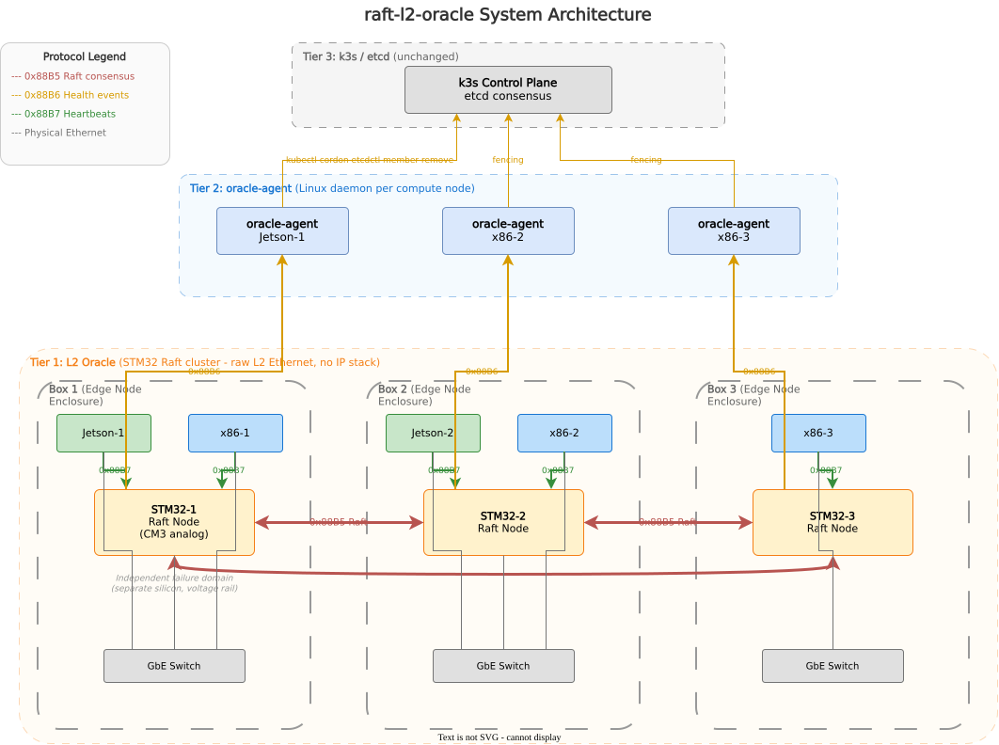
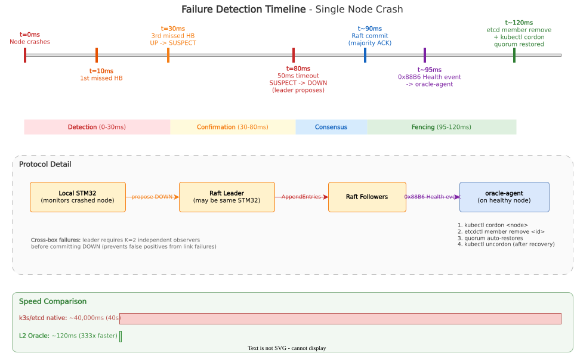

# raft-l2-oracle

Consensus-backed failure detection for distributed edge clusters, running on physically isolated microcontrollers.

## The problem

In a distributed edge cluster, each enclosure contains compute nodes running k3s with etcd. When a node crashes or loses power, k3s takes 40+ seconds to detect the failure and cannot automatically restore etcd quorum. Software-based failure detection running on the same processors it monitors shares their failure domain - when a node kernel panics, its failure monitor dies with it.

## The idea

Many switching ASICs contain an embedded Cortex-M3 service processor. This service processor is on independent silicon from the compute nodes it monitors - separate voltage rail, separate firmware, separate failure domain. It survives compute node crashes, OOM kills, kernel panics, and module-level hardware faults. It also sits directly on the L2 switch fabric with sub-microsecond frame visibility.

This project puts that idle service processor to work: run a lightweight Raft consensus algorithm across the embedded processors, have each one monitor its local compute nodes via L2 heartbeats, and reach cluster-wide agreement on which nodes are alive or dead. The result is consensus-backed failure detection in under 100ms, with automatic etcd quorum restoration in under 2 seconds.

## Architecture



The system has three tiers:

**Tier 1 - L2 Oracle (this repo):** 3-4 STM32 microcontrollers running Raft consensus over raw L2 Ethernet. Each monitors its local compute nodes via 10ms heartbeats and proposes state transitions (UP -> SUSPECT -> DOWN) to the Raft leader. All STM32s maintain an identical, consensus-backed health state table.

**Tier 2 - Oracle-Agent (host/):** A Linux daemon on each compute node. Sends L2 heartbeat frames to its local STM32 ("I'm alive"). Receives health events and executes fencing: `kubectl cordon`, `etcdctl member remove`, `kubectl uncordon`. Cross-checks etcd before destructive actions as a safety interlock.

**Tier 3 - k3s/etcd (unchanged):** Runs normally. The oracle is purely additive - it never replaces or participates in etcd consensus. k3s's built-in tombstone mechanism handles automatic member rejoin after removal.

### Wire protocol

All inter-component communication uses raw Ethernet II frames with custom EtherTypes:

| EtherType | Name | Direction | Purpose |
|-----------|------|-----------|---------|
| `0x88B5` | Raft | STM32 <-> STM32 | Consensus messages (RequestVote, AppendEntries) |
| `0x88B6` | Health | STM32 -> compute | Failure events, cluster state reports |
| `0x88B7` | Heartbeat | Compute -> STM32 | "I'm alive" + load metrics |

Frames use a 24-byte header (14-byte Ethernet II + 10-byte oracle protocol header) followed by 0-64 bytes of packed, little-endian payload. No IP stack, no ARP, no TCP - just L2. This matches the production CM3's communication model (management-frame inject/extract through the switch backplane) and eliminates an entire class of failure modes.

### Failure detection flow

A single node crash is detected and fenced in under 200ms:



For full-box power loss, multi-observer corroboration prevents false positives from asymmetric link failures: at least two STM32s must independently agree a node is down before fencing proceeds.

## What exists today

The firmware (design doc milestones v0.7 and v0.8-in-progress) includes a working POSIX simulator and a complete STM32 firmware ready for hardware verification. The simulator and firmware share the same oracle integration code - only the transport and OS layers differ.

**Firmware (STM32 target):**
- CMake cross-compilation with arm-none-eabi toolchain and presets (`cmake --preset firmware`)
- STM32F2xx HAL + CMSIS startup code (120MHz clock, GPIO, UART, Ethernet MAC)
- FreeRTOS V11.3.0 with heap_4, TIM6 HAL timebase, 72KB heap pool
- STM32 Ethernet transport backend with DMA, LAN8742A PHY initialization (`firmware/transport/transport_eth.c`)
- Raft library adapted for bare-metal: custom heap via `raft_set_heap_functions()`, pre-allocated 1500-entry log
- FreeRTOS task architecture: eth_rx (priority 4), raft (priority 3), health (priority 2), timer daemon
- Health monitoring state machine: UP/SUSPECT/DOWN transitions, multi-observer corroboration, replicated health table
- Clean build: Flash 36KB/1MB (3.45%), RAM 90KB/128KB (69%)

**Simulator (POSIX):**
- Wire protocol definitions - all packed C structs with static size assertions (`firmware/protocol/wire_format.h`)
- Transport HAL abstraction with swappable backends (`firmware/transport/transport.h`)
- UDP loopback transport (`firmware/transport/transport_sim.c`)
- Oracle integration layer - callback bridge between willemt/raft and the transport HAL (`firmware/raft/raft_oracle.c`)
- 3-node POSIX simulator with leader election and chaos mode heartbeat failure detection (`sim/sim_main.c`)

**Verification tools:**
- `tools/frame_sniffer.py` - scapy-based L2 frame capture decoding all 3 oracle EtherTypes
- `tools/heartbeat_sender.py` - simulates compute node heartbeats for testing
- `tools/verify_t10.sh` - orchestrates hardware verification (build, flash, UART capture, sniffer)

**What does not exist yet:**
- Hardware verification (T10 - pending Nucleo-F207ZG USB passthrough)
- Multi-node consensus on hardware (T11)
- Oracle-agent host daemon (v0.10)
- k3s fencing integration (v0.11)

## Repo structure

```
raft-l2-oracle/
  firmware/
    app/main.c                     # STM32 entry point: FreeRTOS tasks, queues, oracle init
    config/FreeRTOSConfig.h        # FreeRTOS tuning (72KB heap, 1kHz tick, priorities)
    config/stm32f2xx_hal_conf.h    # HAL module enables (ETH, GPIO, UART, RCC, TIM)
    core/startup_stm32f207xx.s     # Vector table + Reset_Handler
    core/system_stm32f2xx.c        # SystemInit: HSE -> PLL -> 120MHz
    core/stm32f2xx_it.c            # Interrupt handlers (ETH, SysTick, faults)
    protocol/wire_format.h         # L2 wire protocol (packed structs, EtherTypes, frame header)
    transport/transport.h          # Transport HAL interface (send/recv/now_ms)
    transport/transport_eth.c      # STM32 Ethernet backend (DMA, LAN8742A PHY)
    transport/transport_sim.c/h    # POSIX UDP loopback backend
    raft/raft_oracle.h/c           # Oracle node context + Raft callback bridge
    raft/raft_heap.c               # Bare-metal heap adapter (pvPortMalloc/vPortFree)
    health/health_monitor.h/c      # Health state machine (UP/SUSPECT/DOWN, corroboration)
    health/health_table.c          # Replicated health state table (Raft applylog)
    drivers/CMSIS/                 # ARM Cortex-M3 headers
    drivers/STM32F2xx_HAL_Driver/  # STM32 HAL sources (ETH, GPIO, UART, RCC, TIM, DMA)
    linker/STM32F207ZGTx_FLASH.ld  # Linker script (Flash 0x08000000, SRAM 0x20000000)
    vendor/raft/                   # willemt/raft git submodule (timblaktu/raft, nix branch)
    vendor/freertos/               # FreeRTOS-Kernel V11.3.0 git submodule
    CMakeLists.txt                 # Firmware build (arm-none-eabi cross-compilation)
  sim/
    CMakeLists.txt                 # Simulator build (raft as static lib + our code)
    sim_main.c                     # 3-node threaded simulator with chaos mode
  host/                            # oracle-agent (not yet implemented - v0.10)
  tools/
    frame_sniffer.py               # Scapy L2 frame sniffer (decodes all 3 EtherTypes)
    heartbeat_sender.py            # Simulates compute node heartbeats
    verify_t10.sh                  # Hardware verification orchestrator
  docs/
    design.md                      # Full system design document (v0.5, 1600+ lines)
    architecture.md                # Firmware architecture guide (see below)
    diagrams/                      # DrawIO diagrams (editable .drawio.svg)
    t1-build-environment-research.md
    t2-freertos-integration-research.md
  cmake/arm-none-eabi-gcc.cmake    # Cross-compilation toolchain file
  CMakeLists.txt                   # Top-level (preset-driven dispatch)
  CMakePresets.json                # firmware vs sim presets
  flake.nix                        # Nix dev shell (gcc, cmake, arm-none-eabi-gcc, scapy, etc.)
```

## Building and running

Requires Nix with flakes enabled.

### POSIX simulator

```bash
nix develop                          # enter dev shell
cd sim && mkdir -p build && cd build
cmake .. && make                     # build the POSIX simulator
./raft_sim                           # run 3-node simulation (default)
./raft_sim 5                         # run with 5 nodes
```

The simulator runs for 10 seconds, printing per-node status every second:

```
=== raft-l2-oracle POSIX simulator ===
Nodes: 3, tick: 50ms, runtime: 10s

[node 1] started (port 5001)
[node 2] started (port 5002)
[node 3] started (port 5003)
[node 1] state=LEADER term=1 leader=1 commit_idx=0
[node 2] state=FOLLOWER term=0 leader=1 commit_idx=0
[node 3] state=FOLLOWER term=0 leader=1 commit_idx=0
```

### STM32 firmware

```bash
nix develop                          # enter dev shell (includes arm-none-eabi-gcc)
cmake --preset firmware              # configure cross-compilation
cmake --build build/firmware         # build .elf and .bin
```

Build output: `build/firmware/raft-l2-oracle.elf` (Flash: ~36KB, RAM: ~90KB)

### Flash and verify (requires Nucleo-F207ZG via USB)

```bash
# Flash via OpenOCD + ST-LINK
./tools/verify_t10.sh flash

# Monitor UART output (115200 baud, /dev/ttyACM0)
./tools/verify_t10.sh uart

# Full T10 verification suite
./tools/verify_t10.sh full
```

### Verification tools

```bash
# Capture and decode oracle L2 frames (requires root for raw sockets)
sudo python3 tools/frame_sniffer.py eth0

# Send test heartbeats simulating a compute node
sudo python3 tools/heartbeat_sender.py eth0
```

## Hardware target

**Hackathon board:** STM32 Nucleo-F207ZG (Cortex-M3 @ 120MHz, 128KB SRAM, 1MB Flash, integrated Ethernet MAC + LAN8742A PHY). Chosen because it matches the ARM profile of production switching ASIC service processors and forces the same memory discipline (128KB is tight, which is the point).

**Production target:** Embedded Cortex-M3 service processor in a switching ASIC. Only the transport layer changes - STM32 Ethernet HAL becomes vendor SDK management-frame inject/extract.

## Dependencies

- [willemt/raft](https://github.com/willemt/raft) (BSD-2-Clause) - C Raft consensus library, ~2.2K LOC, zero dependencies, callback-driven. Vendored as git submodule from [timblaktu/raft](https://github.com/timblaktu/raft) fork (adds 118 tests, 3 memory leak fixes, nix dev shell).

## Firmware architecture

For a detailed walkthrough of the firmware internals - FreeRTOS task layout, data flow, memory budget, and how to add new features - see [`docs/architecture.md`](docs/architecture.md).


## Design document

Full specification including memory budget analysis, FreeRTOS task layout, multi-observer corroboration logic, and oracle-agent fencing taxonomy: [`docs/design.md`](docs/design.md) (v0.5).
