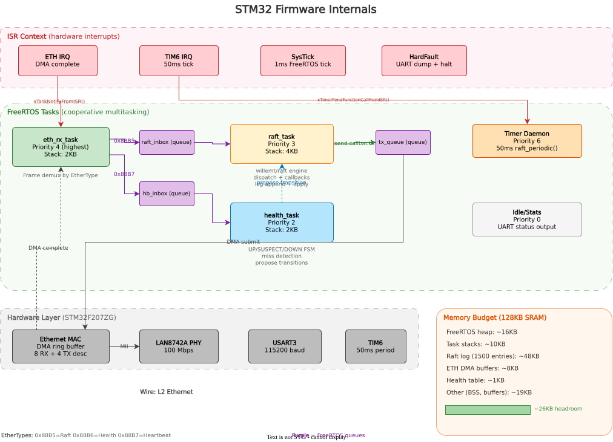

# Firmware Architecture

This document explains how the STM32 firmware is structured, how data flows through it, and where to make changes. It is intended for developers new to the project.

For the full system design (wire protocol specification, memory budget analysis, hardware BOM, oracle-agent design), see [`design.md`](design.md).

## Overview



The firmware runs on an STM32 Nucleo-F207ZG (Cortex-M3 @ 120MHz, 128KB SRAM) using FreeRTOS for task scheduling. It implements a Raft consensus node that communicates with peer STM32s over raw L2 Ethernet and monitors local compute nodes via heartbeat frames.

The code is organized so that the same oracle logic (`raft_oracle.c`, `health_monitor.c`, `wire_format.h`) compiles for both the STM32 firmware and the POSIX simulator. Only the transport layer and OS abstraction differ.

## FreeRTOS tasks

Four tasks run concurrently, connected by FreeRTOS queues:

| Task | Priority | Stack | Role |
|------|----------|-------|------|
| `eth_rx_task` | 4 (highest) | 2KB | Receives frames from DMA, demuxes by EtherType |
| `raft_task` | 3 | 4KB | Runs willemt/raft consensus engine |
| `health_task` | 2 | 2KB | Tracks heartbeats, drives UP/SUSPECT/DOWN state machine |
| timer (daemon) | 6 | 1KB | Fires 50ms ticks for `raft_periodic()` |
| idle/stats | 0 | 1KB | Prints UART status (heap, stack watermarks, raft state) |

### Data flow

1. **Ethernet RX**: The ETH DMA writes received frames into a ring buffer. The ETH IRQ handler fires `xTaskNotifyFromISR()` to wake `eth_rx_task`.

2. **Frame demux**: `eth_rx_task` reads the EtherType from each frame:
   - `0x88B5` (Raft) -> posted to `raft_inbox` queue
   - `0x88B7` (Heartbeat) -> posted to `hb_inbox` queue
   - `0x88B6` (Health) -> currently not received by STM32 (outbound only)

3. **Raft processing**: `raft_task` drains `raft_inbox`, deserializes each frame into the appropriate `msg_*` struct, and calls `oracle_dispatch_raft_message()`. The raft library invokes callbacks (`send_requestvote`, `send_appendentries`, `applylog`) which serialize frames and post them to `tx_queue`.

4. **Health monitoring**: `health_task` drains `hb_inbox`, updates per-node heartbeat timestamps, and runs the state machine. When a node transitions (e.g., UP -> SUSPECT), the health task proposes a Raft log entry via `oracle_propose_health_transition()`.

5. **Ethernet TX**: Outbound frames in `tx_queue` are submitted to the ETH DMA for transmission.

## Key source files

| File | Purpose |
|------|---------|
| `firmware/app/main.c` | Entry point. Creates tasks, queues, initializes HAL/Ethernet/Raft |
| `firmware/protocol/wire_format.h` | Wire protocol structs (all 3 EtherTypes, all message types) |
| `firmware/transport/transport.h` | Transport HAL interface (`send`/`recv`/`now_ms`) |
| `firmware/transport/transport_eth.c` | STM32 Ethernet backend (DMA descriptors, PHY init, raw frame TX/RX) |
| `firmware/transport/transport_sim.c` | POSIX UDP backend (used by simulator only) |
| `firmware/raft/raft_oracle.h/c` | Raft wrapper: init, callbacks, message dispatch, health proposals |
| `firmware/raft/raft_heap.c` | Custom allocators routing raft malloc to `pvPortMalloc` |
| `firmware/health/health_monitor.h/c` | Health state machine and corroboration logic |
| `firmware/health/health_table.c` | Replicated health table (updated in `applylog` callback) |
| `firmware/config/FreeRTOSConfig.h` | FreeRTOS tuning (heap size, tick rate, max priorities) |
| `firmware/core/system_stm32f2xx.c` | Clock configuration (HSE -> PLL -> 120MHz) |
| `firmware/core/stm32f2xx_it.c` | Interrupt handlers (ETH, TIM6, HardFault) |

## Wire protocol

All communication uses raw Ethernet II frames with custom EtherTypes - no IP stack, no ARP, no TCP.

| EtherType | Name | Direction | Purpose |
|-----------|------|-----------|---------|
| `0x88B5` | Raft | STM32 <-> STM32 | Consensus (RequestVote, AppendEntries + responses) |
| `0x88B6` | Health | STM32 -> compute | Failure events, cluster state dumps |
| `0x88B7` | Heartbeat | Compute -> STM32 | "I'm alive" + load metrics (10ms interval) |

Frame layout (24-byte header + 0-64 byte payload):

```
 0           6          12  14 15 16 17  18       22  24
 +----------+----------+---+--+--+--+--+---------+---+- - - - - -+
 | Dst MAC  | Src MAC  |ET |Vr|MT|NI|BI|  Term   |PL | Payload   |
 |   6B     |   6B     |2B |1 |1 |1 |1 |  4B LE  |2B | 0-64B     |
 +----------+----------+---+--+--+--+--+---------+---+- - - - - -+
  <-- Ethernet II (14B) --><-- Oracle Header (10B) -->
```

All payload structs are defined in `wire_format.h` with `__attribute__((packed))` and `_Static_assert` size checks.

## Health state machine

Each STM32 monitors only its **local** compute nodes:

```
 [*] --> UP         MSG_NODE_ANNOUNCE received
 UP --> SUSPECT     3 missed heartbeats (30ms at 10ms interval)
 SUSPECT --> DOWN   50ms no recovery (leader checks corroboration)
 SUSPECT --> UP     heartbeat resumes
 DOWN --> UP        heartbeat resumes
```

State transitions are proposed as Raft log entries. Once committed by the Raft leader with majority agreement, every STM32 applies the transition to its health table.

### Multi-observer corroboration

For cross-box failures (e.g., full box power loss), the leader requires K=2 independent observers to agree before committing a DOWN transition. Observations are piggybacked on the AppendEntries response sideband - no additional frames or protocol. This prevents false positives from asymmetric link failures.

## Memory budget (128KB SRAM)

| Region | Size | Notes |
|--------|------|-------|
| FreeRTOS heap (heap_4) | ~16KB | Task control blocks, queues |
| Task stacks | ~10KB | 4+2+2+1+1 KB |
| Raft log metadata | ~30KB | 1500 entries x 20 bytes (pre-allocated) |
| Raft log payloads | ~18KB | 1500 x 12-byte health transitions (static pool) |
| ETH DMA descriptors + buffers | ~8KB | 8 RX + 4 TX descriptors |
| Health table + corroboration | ~1KB | 16 nodes x 12B + 64B matrix |
| Other (BSS, stack, buffers) | ~19KB | |
| **Headroom** | **~26KB** | Safety margin |

If SRAM becomes tight, the first lever is reducing raft log depth from 1500 to 500 entries (saves 32KB).

## Transport abstraction

The transport HAL (`transport.h`) defines three function pointers:

```c
typedef struct {
    int      (*send)(uint8_t dst_node, uint16_t ethertype,
                     raft_msg_type_t type, const void *payload, size_t len);
    int      (*recv)(uint16_t ethertype, raft_msg_type_t *type,
                     uint8_t *src_node, void *payload, size_t max_len,
                     uint32_t timeout_ms);
    uint64_t (*now_ms)(void);
} raft_transport_t;
```

Three backends exist or are planned:
- `transport_eth.c` - STM32 Ethernet (DMA + FreeRTOS queues)
- `transport_sim.c` - POSIX UDP loopback (development)
- `transport_soc.c` - production SoC service processor transport via vendor SDK (future)

## How to add a new feature

**New message type**: Add the enum value to `raft_msg_type_t` in `wire_format.h`, define the payload struct with `__attribute__((packed))` and a `_Static_assert`, then handle it in the appropriate task's message dispatch.

**New health transition trigger**: Add detection logic in `health_monitor_tick()` and propose the transition via `oracle_propose_health_transition()`.

**New transport backend**: Implement the three functions in `raft_transport_t` and select it at initialization in `main.c`.

## Additional diagrams

- [Raft Message Flow](diagrams/raft-message-flow.md) — sequence diagrams for election, replication, corroboration
- [Health State Machine](diagrams/health-state-machine.md) — state transitions, timing, decision flow
- [Wire Protocol Reference](diagrams/wire-protocol.md) — byte-level frame layout, all message types
- [Network Topology](diagrams/network-topology.md) — physical setup, MAC scheme, frame routing

## Build system

The project uses CMake with presets:

```bash
cmake --preset firmware    # STM32 cross-compilation (arm-none-eabi-gcc)
cmake --preset sim         # POSIX simulator (host gcc)
cmake --build build/firmware
cmake --build build/sim
```

The cross-compilation toolchain is defined in `cmake/arm-none-eabi-gcc.cmake`. The linker script at `firmware/linker/STM32F207ZGTx_FLASH.ld` maps Flash to 0x08000000 and SRAM to 0x20000000.

All dependencies are provided by `nix develop` (Nix flake). For non-Nix environments: `apt install gcc-arm-none-eabi cmake ninja-build openocd`.
