# Design Doc: L2 Failure Detection Oracle — Raft on STM32 with Ethernet Transport

**Status:** Draft v0.5 — extended Raft RPC payloads with follower observation data for multi-observer corroboration; added willemt/raft resource audit and STM32 bare-metal integration notes; corrected memory budget with per-component breakdown
**Project:** Embedded Raft PoC / Hackathon demo
**Approach:** N "boxes" (up to 4), each containing 1x STM32 Nucleo (Cortex-M3) + heterogeneous compute (Jetson / x86) + GbE switch, interconnected to simulate a distributed edge cluster.

---

## Executive Summary

**The problem**: Traditional distributed cluster HA architectures rely on software-only failure detection running on the same processors being monitored. When a node crashes, its failure monitor dies with it, and detection falls back to remote timeout-based mechanisms (typically 40+ seconds for k3s/etcd). This adds latency, complexity, and leaves physically isolated hardware (embedded service processors in switching SoCs) unused.

**The proposal**: Run a lightweight [Raft consensus](https://raft.github.io/) protocol across Cortex-M3 service processors that are physically isolated from the compute nodes they monitor - independent silicon, separate voltage rail, independent firmware. A kernel panic, OOM kill, watchdog timeout, or software fault on the compute node cannot propagate to the service processor, and vice versa. This isolation is what makes the service processor trustworthy as a failure monitor: it can reliably detect and report the death of the very processor it watches because it *cannot fail in the same way at the same time*. This is the same principle behind hardware watchdog timers, but extended to a networked consensus system spanning multiple boxes. (Note: the service processor and compute node share the same box-level power supply - a total box power loss takes out both. The isolation protects against software faults, module-level hardware faults, and independent component failures, not against box-level power loss.)

The service processors sit directly on the switch fabric and can detect L2 link/node failures in microseconds. By having them vote on failure state via Raft, we get **consensus-backed failure detection in under 100ms** - versus the 40+ seconds k3s takes by default. Detection is only half the story: the oracle-agent on each host acts on these decisions by executing `etcdctl member remove` to **restore etcd quorum in ~1.5 seconds**, preventing split-brain immediately. k3s's built-in tombstone mechanism then handles automatic rejoin (~30-90 seconds) - no data wipes, no re-bootstrapping, no custom recovery logic. The entire failure-detection-through-recovery cycle completes in under 2 minutes with zero operator intervention.

**The hackathon PoC**: We use STM32 Nucleo dev boards as prototypes for the embedded service processor - same Cortex-M3 ARM core, real Ethernet, honest resource constraints. We build 3-4 "boxes" (each = 1 STM32 + compute nodes + switch) connected in a star topology, prove sub-100ms detection and ~1.5-second quorum restoration, and demonstrate the full fencing taxonomy (cordon, member remove, recovery). The oracle is purely additive: if it fails, k3s falls back to its normal (slower) detection. It never replaces etcd or the k3s control plane.

**What transfers to production**: The Raft FSM, health monitoring logic, wire protocol, fencing taxonomy, and timing parameters are all designed to run identically on a production embedded service processor. Only the transport layer changes (STM32 Ethernet HAL becomes the SoC's management-frame inject/extract API).

---

## 1. Goal and Non-Goals

### Goal

Demonstrate a **low-latency, L2-only failure detection oracle** running on Cortex-M3 service processors that provides sub-100ms node failure detection and **~1.5-second quorum restoration** to k3s clusters — replacing the default 40-second `node-monitor-grace-period` with hardware-speed consensus and surgical etcd member removal. The result: split-brain is prevented immediately, etcd writes resume in ~1.5 seconds, and the returning node automatically rejoins without operator intervention or data loss.

The STM32 Raft cluster does **not** participate in k3s/etcd consensus. It is an isolated, additive layer: if the oracle is healthy, k3s gets fast failure signals; if the oracle itself fails, k3s falls back to its normal (slower) detection. The oracle is never in the critical path for cluster correctness.

### Why This Matters

**Failure domain isolation.** In a resource-constrained edge cluster, each box contains a switching SoC with an embedded Cortex-M3 service processor. The service processor is physically independent from the application processor it monitors: separate silicon die, separate voltage rail, separate firmware image, no shared memory or OS. This means the software and module-level hardware failure modes are uncorrelated - a Linux kernel panic, an OOM kill, a runaway process, a corrupted filesystem, or a module-level hardware fault cannot affect the service processor. It continues operating through any software failure and most hardware failures of its host. (The service processor and compute node share the same box-level PSU - a total box power loss takes both down. The isolation is against software faults and independent component failures, not against box-level power loss.) This is what makes it architecturally valuable as a failure monitor: it is not subject to the same faults it is designed to detect. By contrast, software-only failure monitors running on the same processor share its failure domain - when the host crashes, the monitor crashes with it.

**Consensus-backed detection.** By running lightweight Raft across the CM3s, we get consensus-backed failure detection — not just "I can't see node X" (which could be a local link issue) but "the majority of the system agrees node X is down." The CM3s sit directly on the switch fabric and can detect L2 link/node failures in microseconds.

**Fast recovery.** Fast detection enables fast recovery: the oracle-agent on the surviving host immediately removes the failed node's etcd members (`etcdctl member remove`), restoring quorum and preventing split-brain within ~1.5 seconds. k3s's built-in tombstone mechanism then handles automatic rejoin when the failed node returns - no data wipes, no operator intervention, no custom recovery logic.

The hackathon PoC substitutes STM32 Nucleo boards for the embedded service processor (same ARM core, real Ethernet, honest resource constraints) and managed/dumb switches for the switch fabric, proving the algorithm and transport on prototype hardware.

### Why This Specific Approach

| Choice | Rationale |
|---|---|
| **Dedicated MCU (not host-side process)** | The oracle must be in a **separate failure domain** from the processors it monitors. A process on the compute node dies with the node. An STM32 on independent silicon survives host crashes and continues detecting and reporting. |
| **STM32F207ZG (real Cortex-M3)** | Same ARM profile as a production embedded service processor. Stresses the actual flash/SRAM envelope. |
| **L2 Ethernet (not UART/SPI)** | Production service processors communicate via management-frame inject/extract through the switch backplane - that's L2. |
| **GbE switches per box** | Simulates the intra-box switch fabric. Prefer small managed switches with 10G uplinks for inter-box spine. |
| **Multi-box topology** | Simulates inter-box communication in a real distributed edge cluster. Raft consensus spans boxes. |
| **willemt/raft C library** | Proven, ~2.2K-line, callback-based design. Zero dependencies. Perfect for bare-metal wrapping. |
| **Failure oracle (not state machine)** | Matches the actual CM3 use case: fast failure detection, not general-purpose replication. |

### Non-Goals (Explicitly Out of Scope for v1)

- Switch-fabric integration (no vendor-specific inject/extract from within a switching SoC).
- IP / TCP / UDP / ARP — everything is raw L2 with custom EtherTypes.
- Persistent log storage on flash — in-SRAM ring buffer only (flash is a v2 concern).
- Snapshots, log compaction, dynamic membership changes.
- General-purpose replicated state machine / key-value store.
- etcd replacement or etcd-shim integration — the oracle feeds health signals to k3s, it does not replace etcd consensus.
- Real deployment on production switching SoC service processor (separate workstream).

---

## 2. Architecture Overview

### What the Oracle Does

The STM32 Raft cluster maintains a **replicated health state table** — a shared, consensus-backed view of which nodes are alive, suspect, or dead across the entire system:

```c
typedef struct {
    uint8_t  node_id;        // unique compute node identifier
    uint8_t  box_id;         // which box this node belongs to
    uint8_t  node_type;      // JETSON, X86, STM32
    uint8_t  status;         // UP, SUSPECT, DOWN
    uint32_t last_seen_ms;   // monotonic timestamp of last heartbeat
    uint32_t status_term;    // Raft term when status was last changed
} node_health_entry_t;

// Max 16 nodes across 4 boxes = 16 * 12 bytes = 192 bytes
// Replicated via Raft AppendEntries on every state transition
```

State transitions are proposed by the Raft leader and replicated to all STM32s. Once committed, **every STM32 in the system agrees** on the health state. This is stronger than any single node's local observation.

### The "Box" Concept

A **box** represents a single node enclosure in the edge cluster. In production, this is a switching SoC with its embedded service processor, plus one or more compute modules - all plugged into the switch's ports. In the hackathon PoC: 1 STM32 (service processor prototype) + 1 Jetson (ARM compute) + 1 x86 mini-PC (x86 compute) + 1 GbE switch (fabric prototype).

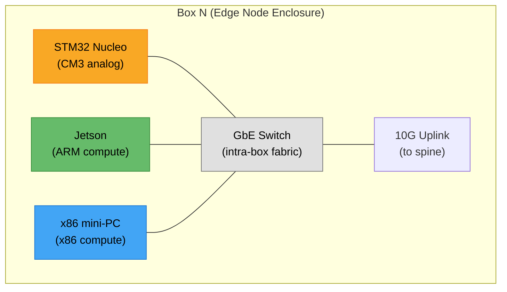

### System Topology (4 boxes, full hackathon)

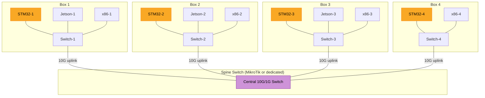

### Inter-Box Connectivity (Decision: Star Topology)

| Option | Pros | Cons | Selected |
|---|---|---|---|
| **Star via 10G-uplink switches** | Low latency, clean box abstraction, VLANable | Requires uplink-capable leaf switches | **YES** |
| Daisy-chain | Simplest cabling | Adds latency per hop, no redundancy | No |
| Single large switch | Cheapest | Loses physical box boundary | No |
| MikroTik 24-port (backup) | Full VLAN/monitoring, already owned | Overkill for PoC unless VLANs needed | Backup |

**Primary plan**: 3x small 1GbE managed switches with 10G SFP+ uplinks (one per box) connected to a central spine. These are the same model already owned (buying 2 more).

**Backup plan**: MikroTik RouterOS 24-port 1GbE switch with port-based VLANs to simulate box isolation. Available if we need proper VLAN tagging or traffic monitoring during development.

### Communication Patterns

Three EtherTypes carry three distinct protocols:

| EtherType | Name | Direction | Purpose |
|---|---|---|---|
| `0x88B5` | Raft | STM32 ↔ STM32 (inter-box) | Consensus: RequestVote, AppendEntries |
| `0x88B6` | Health | STM32 → local compute | Failure events, cluster state reports |
| `0x88B7` | Heartbeat | Compute → local STM32 | "I'm alive" + optional load metrics |

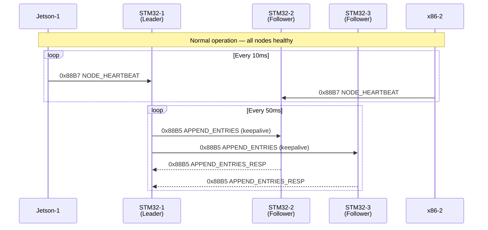

### Failure Detection Flow (Single Node)

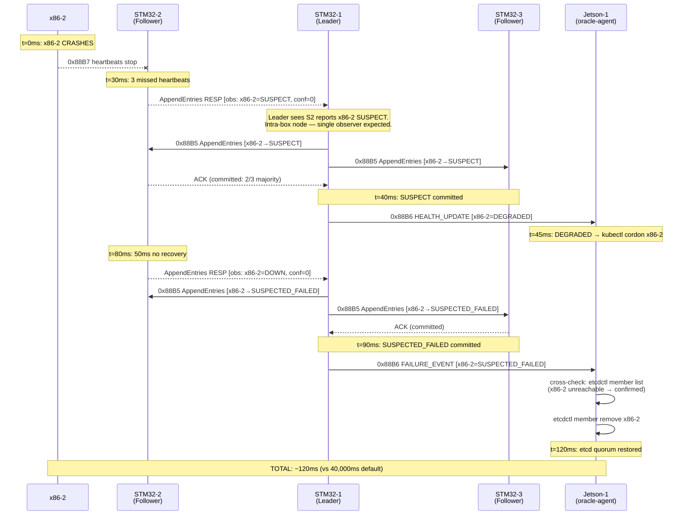

### Failure Detection Flow (Full Box Loss — Corroboration)

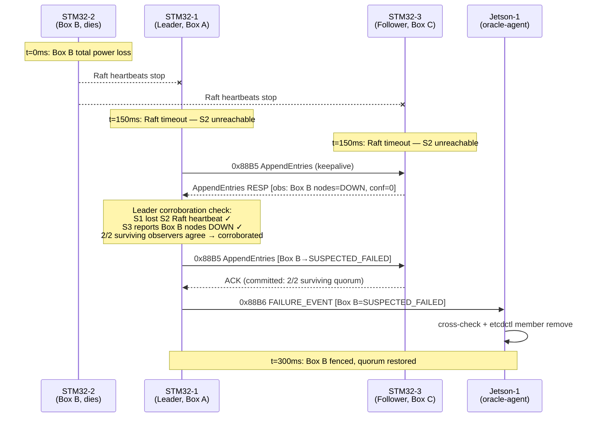

---

## 3. Hardware Bill of Materials

### STM32 Board Selection (LOCKED)

**Primary: Nucleo-F207ZG**

| Spec | Value | Why it matters |
|---|---|---|
| Core | Cortex-M3 @ 120 MHz | Same ARM profile as production service processors |
| SRAM | 128 KB (+4 KB backup) | Forces memory discipline; firmware target ~103 KB |
| Flash | 1 MB | Ample for firmware + debug symbols |
| Ethernet | Integrated MAC + LAN8742A PHY | RJ45 out-of-box, raw MAC access via HAL |
| Debug | On-board ST-LINK/V2-1 | Single USB cable for power + flash + SWD |
| Price | ~$28 | |

**Fallback: Nucleo-F429ZI** (if F207ZG unavailable)
- Cortex-M4F @ 180 MHz, 256 KB SRAM, same Ethernet HW, ~$30.
- Overpowered (not a faithful M3 analog) but proves the transport layer works.

### Networking

| Item | Qty | Spec | Purpose |
|---|---|---|---|
| 1GbE managed switch w/ 10G uplink | 3 | (same model already owned) | Intra-box fabric, one per box |
| Spine switch or direct-connect | 1 | 10G or 1G depending on leaf model | Inter-box star hub |
| Cat6 patch cables, 1-3 ft | ~15 | Standard | Intra + inter-box |
| USB-A to Mini-USB | 3-4 | For Nucleo power/debug | |

**Backup networking**: MikroTik RouterOS 24-port 1GbE switch (already owned). Provides VLAN isolation, traffic mirroring, and per-port statistics if needed for debugging or production-like topology testing.

### Full BOM (4-box demo, excluding compute)

| Category | Items | Est. Cost |
|---|---|---|
| STM32 Nucleos (F207ZG) | 4 | ~$112 |
| Intra-box switches (if not reusing existing) | 3 | ~$45-90 |
| Spine switch (if needed beyond existing) | 1 | ~$25-50 |
| Cables + USB | ~20 | ~$50 |
| **Total (excl. compute)** | | **~$230-300** |

### Compute Nodes (assumed in-hand)

| Type | Qty | Role |
|---|---|---|
| Jetson Orin Nano dev kit | 2-3 | ARM compute (k3s worker nodes) |
| x86 mini PC (NUC / similar) | 2-3 | x86 compute (k3s CP or workers) |

### STM32 Inventory (PENDING)

User has multiple STM32 boards in inventory — checking for Ethernet-equipped models. If no Ethernet-capable boards are available, order F207ZG Nucleos specifically.

---

## 4. L2 Wire Protocol (Byte-Level Specification)

### Frame Layout

All messages are raw Ethernet II frames. No 802.1Q VLAN tag for v1 (but infrastructure supports it via MikroTik if needed later).

| Offset | Size | Field | Notes |
|-------:|-----:|-------|-------|
| 0 | 6 | Destination MAC | Unicast to target STM32 or `FF:FF:FF:FF:FF:FF` |
| 6 | 6 | Source MAC | Sender's MAC |
| 12 | 2 | EtherType | `0x88B5` / `0x88B6` / `0x88B7` (big-endian) |
| 14 | 1 | Version | Upper nibble = protocol version (1), lower = reserved |
| 15 | 1 | MsgType | `raft_msg_type_t` enum (see below) |
| 16 | 1 | NodeID | Sender's node ID |
| 17 | 1 | BoxID | Sender's box ID |
| 18 | 4 | Term | Raft term, little-endian. `0` for non-Raft messages. |
| 22 | 2 | Payload Length | Little-endian. Max 64 bytes for v1. |
| 24 | 0-64 | Payload | Variable, format depends on MsgType |

```
 0           6          12  14 15 16 17  18       22  24
 ┌──────────┬──────────┬───┬──┬──┬──┬──┬─────────┬───┬─ ─ ─ ─ ─ ┐
 │ Dst MAC  │ Src MAC  │ET │Vr│MT│NI│BI│  Term   │PL │ Payload   │
 │   6B     │   6B     │2B │1 │1 │1 │1 │  4B LE  │2B │ 0-64B     │
 └──────────┴──────────┴───┴──┴──┴──┴──┴─────────┴───┴─ ─ ─ ─ ─ ┘
  ◄── Ethernet II (14B) ──►◄── Oracle Header (10B) ─►

 ET = EtherType (0x88B5/B6/B7)   Vr = Version    MT = MsgType
 NI = NodeID                     BI = BoxID       PL = Payload Length
```

### Header Structure (C definition)

```c
typedef struct __attribute__((packed)) {
    /* Ethernet II header (14 bytes) */
    uint8_t  dst_mac[6];
    uint8_t  src_mac[6];
    uint16_t ethertype;         /* 0x88B5, 0x88B6, or 0x88B7 (big-endian on wire) */

    /* Oracle protocol header (10 bytes) */
    uint8_t  version;           /* upper nibble = version (1), lower = reserved */
    uint8_t  msg_type;          /* raft_msg_type_t enum */
    uint8_t  node_id;           /* sender's node ID */
    uint8_t  box_id;            /* sender's box ID */
    uint32_t term;              /* Raft term (little-endian). 0 for non-Raft. */
    uint16_t payload_len;       /* little-endian. Max 64 for v1. */

    /* Payload follows (variable length) */
} oracle_frame_header_t;

_Static_assert(sizeof(oracle_frame_header_t) == 24, "header must be 24 bytes");
```

**Total frame sizes** (excluding Ethernet preamble/SFD/FCS added by MAC):
- Minimum (heartbeat, no payload): 24 + 8 = **32 bytes** (padded to 60 by MAC)
- Typical Raft keepalive: 24 + 16 = **40 bytes**
- AppendEntries response (with observations): 24 + 48 = **72 bytes**
- AppendEntries with 1 health entry: 24 + 48 = **72 bytes**
- Full cluster state dump (16 nodes): 24 + 192 = **216 bytes**

All well under the 1500-byte MTU. No fragmentation concerns.

### MAC Address Allocation

Locally administered (U/L bit set, I/G bit clear):

| Node | MAC | Scheme |
|---|---|---|
| STM32-1 | `02:CA:FE:01:00:01` | `02:CA:FE:<box>:00:<role>` |
| STM32-2 | `02:CA:FE:02:00:01` | role `01` = STM32 |
| STM32-3 | `02:CA:FE:03:00:01` | |
| STM32-4 | `02:CA:FE:04:00:01` | |
| Broadcast (health) | `FF:FF:FF:FF:FF:FF` | For MSG_CLUSTER_STATE to all local compute |
| Compute nodes | Native MACs | Registered at boot via MSG_NODE_ANNOUNCE |

### MsgType Enum (Complete)

```c
typedef enum {
    /* Raft consensus (EtherType 0x88B5) — STM32 <-> STM32 inter-box */
    MSG_REQUEST_VOTE          = 0x01,
    MSG_REQUEST_VOTE_RESP     = 0x02,
    MSG_APPEND_ENTRIES        = 0x03,
    MSG_APPEND_ENTRIES_RESP   = 0x04,

    /* Health reports (EtherType 0x88B6) — STM32 -> local compute */
    MSG_HEALTH_UPDATE         = 0x10,  /* single node status change */
    MSG_CLUSTER_STATE         = 0x11,  /* full health table dump (periodic) */
    MSG_FAILURE_EVENT         = 0x12,  /* urgent: node confirmed DOWN */

    /* Node heartbeats (EtherType 0x88B7) — compute -> local STM32 */
    MSG_NODE_HEARTBEAT        = 0x20,  /* periodic "I'm alive" */
    MSG_NODE_ANNOUNCE         = 0x21,  /* initial registration at boot */
    MSG_NODE_ANNOUNCE_ACK     = 0x22,  /* STM32 confirms registration */
} raft_msg_type_t;
```

### Payload Formats (Byte-Level)

#### MSG_REQUEST_VOTE (0x01) — 16 bytes payload

```c
typedef struct __attribute__((packed)) {
    uint32_t candidate_id;      /* node_id of candidate (extended to 32-bit for alignment) */
    uint32_t last_log_idx;      /* index of candidate's last log entry */
    uint32_t last_log_term;     /* term of candidate's last log entry */
    uint32_t _reserved;         /* pad to 16 bytes */
} payload_request_vote_t;
```

Note: `term` is already in the frame header.

#### MSG_REQUEST_VOTE_RESP (0x02) — 8 bytes payload

```c
typedef struct __attribute__((packed)) {
    uint32_t vote_granted;      /* 1 = granted, 0 = denied */
    uint32_t current_idx;       /* responder's current log index */
} payload_request_vote_resp_t;
```

#### MSG_APPEND_ENTRIES (0x03) — 16 + N*32 bytes payload

```c
typedef struct __attribute__((packed)) {
    uint32_t prev_log_idx;      /* index of log entry before new ones */
    uint32_t prev_log_term;     /* term of that entry */
    uint32_t leader_commit;     /* leader's commit index */
    uint8_t  n_entries;         /* number of entries (0 = heartbeat) */
    uint8_t  _pad[3];
    /* followed by n_entries * raft_log_entry_wire_t */
} payload_append_entries_t;

typedef struct __attribute__((packed)) {
    uint32_t term;              /* term when entry was created */
    uint32_t index;             /* log index */
    uint8_t  entry_type;        /* HEALTH_TRANSITION or MEMBERSHIP */
    uint8_t  target_node_id;    /* which node this applies to */
    uint8_t  target_box_id;
    uint8_t  old_status;        /* previous status (UP/SUSPECT/DOWN) */
    uint8_t  new_status;        /* new status */
    uint8_t  _pad[3];
    uint32_t timestamp_ms;      /* when the event was observed */
    uint64_t _reserved;         /* future use, zero for now */
} raft_log_entry_wire_t;        /* 32 bytes */
```

#### MSG_APPEND_ENTRIES_RESP (0x04) — 12 + 4*N bytes payload

```c
typedef struct __attribute__((packed)) {
    /* Standard Raft fields */
    uint32_t success;           /* 1 = success, 0 = failure */
    uint32_t current_idx;       /* highest log index we have */
    uint32_t first_idx;         /* first idx received in this batch */

    /* --- Follower observation sideband (non-Raft extension) --- */
    /* Piggybacked on every AppendEntries response. The leader accumulates
     * these to build a corroboration matrix: before proposing a DOWN
     * transition, it checks whether K-of-N STM32s independently agree
     * the node is unreachable. This rides on traffic that already flows
     * every 50ms — zero additional frames, zero new protocol. */
    uint8_t  n_observations;    /* number of local nodes observed (0-8) */
    uint8_t  _obs_pad[3];
    struct __attribute__((packed)) {
        uint8_t  node_id;
        uint8_t  observed_status;   /* NODE_UP=0, NODE_SUSPECT=1, NODE_DOWN=2 */
        uint8_t  confidence;        /* heartbeats_received / heartbeats_expected
                                     * over last observation window (0-255) */
        uint8_t  _pad;
    } obs[8];                   /* max 8 local nodes per box */
} payload_append_entries_resp_t;
/* Fixed part: 12 bytes. Observation part: 4 + 8*4 = 36 bytes.
 * Total max: 48 bytes. Well within 64-byte v1 payload limit.
 * Receivers use n_observations to determine actual observation count. */
```

**Design rationale:** The willemt/raft library's `msg_appendentries_response_t` already carries sideband fields beyond the Raft paper spec (`current_idx`, `first_idx`) with an explicit `/* Non-Raft fields follow: */` comment. Our observation extension follows the same pattern. Because the library never serializes messages (all wire format is caller-controlled via callbacks), and accesses only named fields (`r->success`, `r->current_idx`, etc.), appending observation data has zero interaction with the Raft algorithm. See Section 5.3 for the library analysis that validates this.

#### MSG_HEALTH_UPDATE (0x10) — 12 bytes payload

```c
typedef struct __attribute__((packed)) {
    uint8_t  target_node_id;
    uint8_t  target_box_id;
    uint8_t  old_status;        /* NODE_UP=0, NODE_SUSPECT=1, NODE_DOWN=2 */
    uint8_t  new_status;
    uint32_t term;              /* term when this transition was committed */
    uint32_t timestamp_ms;      /* monotonic timestamp */
} payload_health_update_t;
```

#### MSG_FAILURE_EVENT (0x12) — 12 bytes payload

Same layout as `payload_health_update_t`. Distinguished by msg_type (allows different BPF filter priority on host).

#### MSG_CLUSTER_STATE (0x11) — 4 + N*12 bytes payload

```c
typedef struct __attribute__((packed)) {
    uint8_t  n_nodes;           /* number of entries following */
    uint8_t  leader_node_id;    /* current Raft leader */
    uint8_t  leader_box_id;
    uint8_t  quorum_healthy;    /* 1 = oracle has quorum, 0 = degraded */
    /* followed by n_nodes * node_health_entry_t (12 bytes each) */
} payload_cluster_state_t;
```

#### MSG_NODE_HEARTBEAT (0x20) — 8 bytes payload

```c
typedef struct __attribute__((packed)) {
    uint32_t seq;               /* monotonic sequence number */
    uint16_t load_pct;          /* CPU load 0-1000 (0.1% resolution), optional */
    uint16_t _reserved;
} payload_node_heartbeat_t;
```

#### MSG_NODE_ANNOUNCE (0x21) — 16 bytes payload

```c
typedef struct __attribute__((packed)) {
    uint8_t  node_type;         /* NODE_TYPE_JETSON=1, NODE_TYPE_X86=2 */
    uint8_t  _pad[3];
    uint8_t  mac[6];            /* node's real MAC (for reverse lookup) */
    uint8_t  hostname[6];       /* first 6 chars of hostname (debug aid) */
} payload_node_announce_t;
```

#### MSG_NODE_ANNOUNCE_ACK (0x22) — 4 bytes payload

```c
typedef struct __attribute__((packed)) {
    uint8_t  assigned_node_id;  /* STM32 confirms: "you are node N" */
    uint8_t  box_id;            /* "you belong to box M" */
    uint8_t  status;            /* initial status (UP) */
    uint8_t  _pad;
} payload_node_announce_ack_t;
```

### Wire Encoding Rules

- **Byte order**: All multi-byte fields are little-endian (ARM native). Exception: EtherType field follows Ethernet II convention (big-endian on wire).
- **Alignment**: Structs are `__attribute__((packed))`. No implicit padding.
- **Versioning**: `version` field upper nibble = 1 for v1. Receivers MUST reject unknown versions.
- **Frame padding**: Frames shorter than 60 bytes (excluding FCS) are padded with zeros by the MAC. Receivers use `payload_len` to determine actual content size.

---

## 5. Raft Implementation (willemt/raft Integration)

### 5.1 Why willemt/raft

The [willemt/raft](https://github.com/willemt/raft) C library is the chosen Raft implementation base:

| Property | Value | Fit |
|---|---|---|
| Language | C99 | Native to bare-metal STM32 |
| Size | ~2.2K lines (4 source files), ~9 KB .text on Thumb-2 | Fits comfortably in 1MB flash |
| Dependencies | None | No libc requirements beyond basic types |
| Architecture | Callback-based (`raft_cbs_t`) | Maps 1:1 to our transport HAL |
| License | BSD-2-Clause | Permissive |
| Features | Elections, AppendEntries, membership changes, snapshots | We use elections + AppendEntries |
| Test suite | Comprehensive (CuTest-based) | Runs on host, validates algorithm |

### 5.2 Callback Mapping

The `raft_cbs_t` structure defines how the library interacts with the outside world. Our implementation fills these:

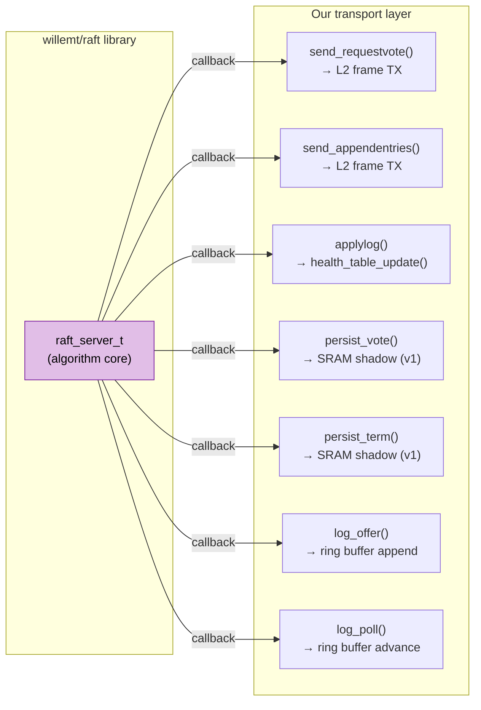

### 5.2.1 Key API Usage

```c
/* Initialization */
raft_server_t *raft = raft_new();
raft_set_callbacks(raft, &our_callbacks, &our_context);
raft_add_node(raft, NULL, MY_NODE_ID, 1 /* is_self */);
raft_add_node(raft, NULL, PEER_1_ID, 0);
raft_add_node(raft, NULL, PEER_2_ID, 0);
// ... up to 4 nodes

/* Periodic tick (called from timer_task, every 1ms) */
raft_periodic(raft, elapsed_ms);
// Internally handles election timeouts, heartbeat TX

/* Receiving messages (from eth_rx_task via queue) */
raft_recv_requestvote(raft, sending_node, &rv_msg);
raft_recv_appendentries(raft, sending_node, &ae_msg);

/* Proposing health state changes (from health_task) */
raft_entry_t entry = {
    .term = raft_get_current_term(raft),
    .id = next_entry_id++,
    .type = RAFT_LOGTYPE_NORMAL,
    .data = { .buf = &health_transition, .len = sizeof(health_transition) }
};
raft_recv_entry(raft, &entry, &response);
```

### 5.3 Library Internals Audit (STM32F207ZG Resource Awareness)

A source-level audit of willemt/raft confirms the library is well-suited to bare-metal deployment, with a few specific integration points to manage. This section documents the findings so they are available during implementation.

#### Message Handling Model

**The library does not serialize or deserialize any messages.** It constructs message structs on the stack, populates named fields, and passes a pointer to the caller's callback. The caller owns the wire format completely. On the receive side, the caller deserializes into the struct and calls `raft_recv_*()`. This is why extending `msg_appendentries_response_t` with observation sideband data (Section 4) has zero interaction with the library — it never touches fields it doesn't know about.

The library's `msg_appendentries_response_t` already contains a `/* Non-Raft fields follow: */` comment with `current_idx` and `first_idx` as library-specific extensions beyond the Raft paper. Our observation fields follow the same established pattern.

#### Data Type Sizes on Cortex-M3 (ILP32)

All library types map to 4-byte integers on ARM:

| Type | C typedef | sizeof (ARM) |
|---|---|---|
| `raft_term_t` | `long int` | 4 |
| `raft_index_t` | `long int` | 4 |
| `raft_node_id_t` | `int` | 4 |
| `raft_entry_id_t` | `int` | 4 |
| `raft_entry_t` | struct | **20** (term + id + type + data.buf + data.len) |

**Note:** `sizeof(raft_entry_t)` = 20 bytes on ARM, not 32. The `data` field is `{void *buf, unsigned int len}` — a pointer and length. The library copies this 20-byte struct by `memcpy` into the log ring buffer but **never dereferences `data.buf`**. Entry payload memory is entirely the caller's responsibility, managed via `log_offer` / `log_poll` / `log_pop` callbacks.

Zero `float`, `double`, or `long long` anywhere in `src/`. No FPU instructions will be generated.

#### Memory Allocation Sites (6 total)

The library provides `raft_set_heap_functions()` (`raft.h:937`) to replace malloc/calloc/realloc/free without modifying library source. All allocation sites:

| Site | File | Frequency | Size (our config) |
|---|---|---|---|
| `raft_server_private_t` | `raft_server.c:72` | One-time | 100 B |
| `log_private_t` | `raft_log.c:91` | One-time | 32 B |
| Entry array (initial) | `raft_log.c:96` | One-time | `INITIAL_CAPACITY` × 20 B |
| Entry array (growth) | `raft_log.c:57` | **Recurring — doubles on full** | Up to 2048 × 20 = 40,960 B |
| Node structs | `raft_node.c:42` | Per-node (max 8) | 8 × 20 = 160 B |
| Nodes pointer array | `raft_server.c:979` | Per-node realloc | 8 × 4 = 32 B |

**Critical: the log doubling in `__ensurecapacity()` (`raft_log.c:49`) must be prevented.** Stock behavior: starting at 10 entries, it doubles through 10→20→40→...→2048 to accommodate 1500 entries, wasting 10.7 KB from unused slots. Worse, an unexpected doubling from 2048→4096 would allocate 80 KB and OOM. Fix: `raft_new()` at line 81 calls `log_new()` which starts at `INITIAL_CAPACITY=10`. Patch this one line to call `log_alloc(MAX_LOG_ENTRIES)` directly, pre-allocating the exact capacity. Then make our custom `realloc` return NULL — the library checks return values and propagates `RAFT_ERR_NOMEM` cleanly.

#### Stack Usage

One concern: `__log()` at `raft_server.c:47` declares `char buf[1024]` for `vsprintf` debug formatting. This 1 KB stack allocation occurs on every debug log call. Mitigations:
- **Production:** Never set the `log` callback in `raft_cbs_t`. The function early-returns at line 50 before touching the buffer. With LTO, the compiler may eliminate the function entirely.
- **Debug builds:** Replace `vsprintf` + 1024-byte buffer with `vsnprintf` + 128-byte buffer, or route to UART with a fixed-format writer.
- **Belt-and-suspenders:** `#define __log(...)` as a no-op via build flag for release images. This also eliminates ~50 format string constants from `.rodata`.

No recursion, no VLAs anywhere in the library. All loops are iterative.

#### Code Size

4 source files totaling ~2,200 lines. Estimated ~9 KB `.text` on Thumb-2. Irrelevant against 1 MB flash. No conditional compilation exists for feature exclusion (snapshots, dynamic membership), but unused code paths are dead-code-eliminated by `--gc-sections` with `-ffunction-sections`.

#### `rand()` for Election Timeout Jitter

`raft_server.c:65` uses `rand() % election_timeout` for randomized election timeouts. On bare-metal: either seed libc's PRNG from the STM32 RNG peripheral at startup, or patch this single line to use a local xorshift32. Trivial either way.

### 5.4 Modifications Required

The willemt/raft library needs minimal changes for bare-metal:

1. **Static memory allocation**: Provide pool-backed allocators via `raft_set_heap_functions()`. No source modification needed for the basic case. The one exception: patch `raft_new()` to call `log_alloc(MAX_LOG_ENTRIES)` instead of `log_new()` (one-line change) to pre-allocate the log at exact capacity.
2. **Prevent log growth**: Custom `realloc` returns NULL for the log doubling path. Library handles `RAFT_ERR_NOMEM` gracefully.
3. **Timer source**: `raft_periodic()` takes elapsed ms — feed from FreeRTOS `xTaskGetTickCount()`.
4. **No snapshots**: Don't implement `send_snapshot` callback (return error, assert on v1).
5. **Entry payload pool**: Manage a static pool of health transition structs (12 bytes each) for `raft_entry_t.data.buf`. Return to pool in `log_poll`/`log_pop` callbacks.
6. **Debug logging**: Stub `__log()` for production; optionally shrink buffer for debug builds.

### 5.5 Zig Migration Consideration

Open question: migrate firmware to Zig for:
- Compile-time safety (no UB, no implicit casts)
- Deterministic memory layout without `__attribute__((packed))` hacks
- Better cross-compilation story (Zig's built-in ARM cross-compiler)
- Smaller binaries (no libc, no startup cruft)
- `comptime` for static config injection (node IDs, MAC addresses)

**Decision**: Start with C (willemt/raft is C, STM32 HAL is C, familiarity). Evaluate Zig port after v1 demo if resource pressure or UB bugs motivate it. The transport HAL boundary makes this a module-by-module migration if pursued.

---

## 6. STM32 Firmware Architecture

### FreeRTOS Task Layout

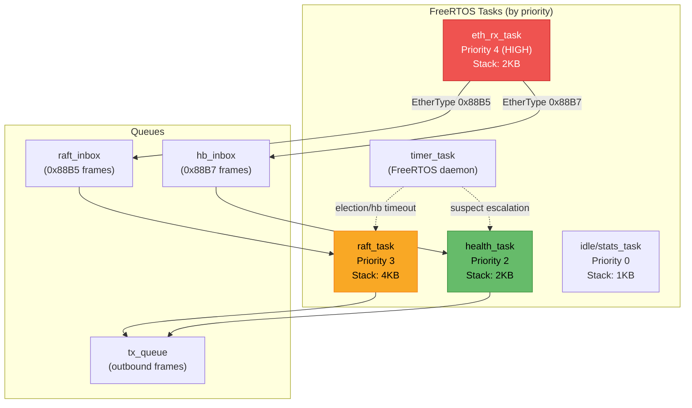

### Memory Budget (STM32F207ZG, 128 KB SRAM)

Revised after source-level audit of willemt/raft (Section 5.3). Key correction: `sizeof(raft_entry_t)` = 20 bytes on ARM, not 32. The `data.buf` payload is a separate allocation managed by our callbacks.

| Region | Size | Notes |
|---|---|---|
| FreeRTOS kernel + heap | ~16 KB | Static allocation preferred |
| Task stacks (sum) | ~10 KB | 4+2+2+1+1 KB. Reduced: `__log()` stubbed in production (see 5.3) |
| MAC RX/TX descriptor rings | ~8 KB | 8 RX + 4 TX descriptors |
| **Raft library fixed structs** | **~0.3 KB** | `raft_server_private_t`(100) + `log_private_t`(32) + 8 nodes(160) + ptr array(32) |
| **Raft log entry metadata** | **~30 KB** | 1500 × `sizeof(raft_entry_t)` = 1500 × 20 bytes. Pre-allocated, no doubling. |
| **Raft log entry payloads** | **~18 KB** | 1500 × 12-byte health transition structs. Static pool, returned via `log_poll`. |
| Health state table | ~1 KB | 16 nodes × 12 bytes + metadata |
| **Observation corroboration table** | **~0.1 KB** | Leader-side: `uint8_t[MAX_PEERS][MAX_NODES]` = 4×16 = 64 bytes + timestamps |
| Message buffers (in-flight) | ~8 KB | 4 frames × 1.5 KB + queues |
| Heartbeat tracking | ~2 KB | Per-node timer state |
| Static / BSS | ~8 KB | Globals, constants |
| **Total** | **~102 KB** | |
| **Headroom** | **~26 KB** | Safety margin |

**Memory pressure notes:**
- The 1500-entry log depth is conservative. If SRAM headroom becomes tight, the first lever is reducing log depth — 500 entries (10 KB metadata + 6 KB payloads = 16 KB) would save 32 KB with acceptable log history for the fencing oracle use case.
- The observation sideband extension (Section 4) adds ~100 bytes total SRAM (64-byte corroboration table + per-frame overhead in buffers). Negligible.
- Do not prematurely optimize. Measure actual usage after firmware boots and adjust log depth based on observed high-water mark.

### Health Monitoring Logic

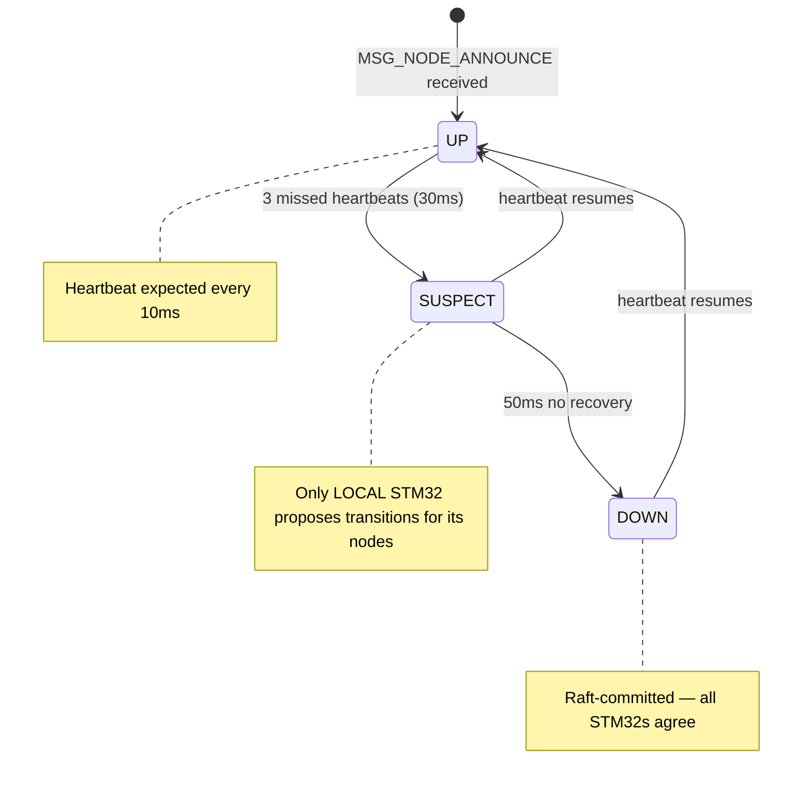

Each STM32 monitors only its **local** compute nodes:
- Expect `MSG_NODE_HEARTBEAT` every 10ms
- 3 consecutive misses (30ms) → mark SUSPECT locally
- If leader: propose SUSPECT via Raft
- If not leader: observation is reported to the leader via AppendEntries response sideband (see below)
- SUSPECT + 50ms no recovery → propose DOWN
- Heartbeat resumes at any point → propose UP

**Box-loss detection**: When an STM32 itself goes silent, remaining STM32s detect it via Raft heartbeat timeout (~150-300ms). All nodes in that box are marked DOWN by the leader.

### Multi-Observer Corroboration (Observation Sideband)

Every follower piggybacks its local health observations onto the `MSG_APPEND_ENTRIES_RESP` it already sends to the leader every 50ms (see Section 4, extended `payload_append_entries_resp_t`). No additional frames, timers, or protocol are required — the observations ride on Raft traffic that already flows.

**Leader-side corroboration logic:**

```c
/* Leader maintains a corroboration matrix in SRAM (~64 bytes) */
typedef struct {
    uint8_t  status[MAX_PEERS][MAX_NODES];    /* last-reported status per observer */
    uint32_t updated_ms[MAX_PEERS];           /* when each peer last reported */
} corroboration_table_t;

/* On each AppendEntries response from a follower: */
void leader_update_observations(uint8_t peer_id,
                                const payload_append_entries_resp_t *resp) {
    for (int i = 0; i < resp->n_observations; i++) {
        corroboration.status[peer_id][resp->obs[i].node_id] =
            resp->obs[i].observed_status;
    }
    corroboration.updated_ms[peer_id] = now_ms();
}

/* Before proposing a DOWN transition: */
bool corroborated(uint8_t target_node_id, uint8_t required_k) {
    uint8_t agree = 0;
    for (int p = 0; p < num_peers; p++) {
        if (now_ms() - corroboration.updated_ms[p] > STALE_THRESHOLD_MS)
            continue;  /* stale observation — peer may be dead itself */
        if (corroboration.status[p][target_node_id] >= NODE_SUSPECT)
            agree++;
    }
    return agree >= required_k;
}
```

**What this enables:**

| Scenario | Single-observer (current) | With corroboration |
|---|---|---|
| x86-2 crashes | STM32-2 proposes DOWN | Leader checks: STM32-2 reports DOWN. STM32-1,3 have no info (x86-2 is not their local node). Proceeds — single observer is expected for intra-box nodes. |
| Full Box B power loss | STM32-2 goes silent (Raft timeout) | Leader checks: STM32-1 and STM32-3 both report all Box B nodes SUSPECT/DOWN via observations. **Two independent observers corroborate.** High confidence. |
| Inter-box link A↔B fails | STM32-1 (leader) loses STM32-2 Raft heartbeat | Leader checks: STM32-3 still reports Box B nodes as UP. **Corroboration fails — this is a link issue, not a box failure.** Leader does NOT propose fencing Box B. |

The third scenario is the key improvement: asymmetric failure disambiguation. Without corroboration, the leader would propose DOWN based on its own Raft heartbeat timeout with STM32-2. With corroboration, STM32-3's continued observation of Box B health prevents a false positive.

**Design constraints:**
- Corroboration is advisory for the leader, not a Raft safety mechanism. The leader MAY proceed without corroboration for intra-box nodes (where only one STM32 can observe them). Corroboration gates cross-box fencing decisions.
- Stale observations (peer hasn't reported recently) are excluded — a dead peer shouldn't veto fencing.
- The `confidence` byte (heartbeats_received/expected ratio) allows the leader to weight observations — a peer reporting 95% confidence is more informative than one at 20%.
- Required corroboration threshold (K) is configurable: K=1 for 2-box (no cross-box corroboration possible), K=2 for 3-4 box deployments.

### Transport Abstraction (HAL)

```c
typedef struct {
    int  (*send)(uint8_t dst_node, uint16_t ethertype,
                 raft_msg_type_t type, const void *payload, size_t len);
    int  (*recv)(uint16_t ethertype, raft_msg_type_t *type,
                 uint8_t *src_node, void *payload, size_t max_len,
                 uint32_t timeout_ms);
    uint64_t (*now_ms)(void);
} raft_transport_t;
```

Implementations:
- `transport_eth.c` — STM32 ETH peripheral + FreeRTOS queues (production)
- `transport_sim.c` — POSIX UDP loopback (development/testing)
- Future: `transport_soc.c` — production SoC service processor transport via vendor SDK

---

## 7. Host Daemon Architecture (oracle-agent)

### 7.1 Role

The oracle-agent is **not** a Raft participant. It participates in neither the STM32's oracle Raft nor k3s's embedded etcd Raft. It is the oracle's **agent on the host** — it acts on the oracle's committed decisions.

1. **Heartbeat sender** — sends periodic L2 frames (0x88B7) to the local STM32, signaling "I'm alive." The STM32 monitors these heartbeats to detect host failure.
2. **Fencing executor** — receives committed fencing events from the STM32 via L2 frames (0x88B6) and executes the corresponding action:
   - `FENCE_CORDON`: `kubectl cordon <node>` (advisory, non-destructive)
   - `FENCE_MEMBER_REMOVE`: `etcdctl member remove <id>` (destructive — restores quorum)
   - `FENCE_STONITH`: GPIO reset (production only, not in PoC)
   - `FENCE_CLEAR`: `kubectl uncordon <node>` (recovery)
3. **Safety interlock** — before executing destructive actions (`FENCE_MEMBER_REMOVE`), cross-checks etcd's own view of the target. If etcd reports the target as healthy and reachable, the oracle-agent **vetoes** the fence event (likely an SDMA link issue, not a real failure). See Section 8.4.
4. **Recovery monitor** — after fencing, monitors the returning node's rejoin progress by polling `etcdctl member list`. Executes `FENCE_CLEAR` only after confirming the node has rejoined as a voting member. See Section 7.3.

### 7.2 Architecture

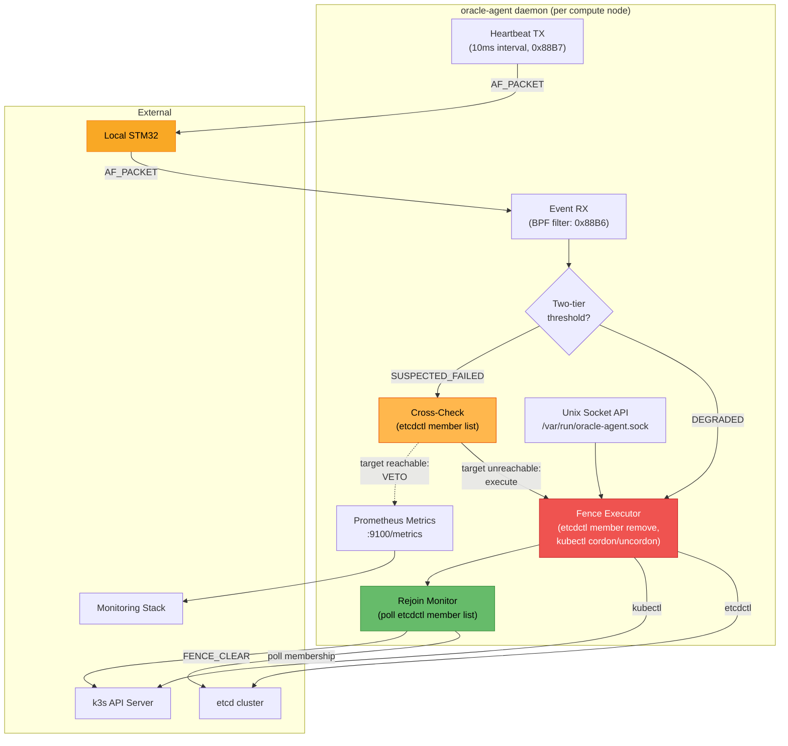

**Two-tier event handling:**
- **DEGRADED** events (M missed heartbeats) → `FENCE_CORDON` directly. Advisory, safe on false positives.
- **SUSPECTED_FAILED** events (N missed heartbeats, N > M) → cross-check etcd first, then `FENCE_MEMBER_REMOVE` if confirmed. Destructive, requires higher confidence.

### 7.3 Tombstone Awareness and Rejoin Monitoring

The oracle-agent does **not** orchestrate member rejoin after fencing. k3s has a built-in tombstone mechanism (see Section 8.5) that handles the full rejoin lifecycle automatically:

1. Removed member discovers removal → writes tombstone → shuts down
2. systemd restarts k3s → detects tombstone → backs up data dir → joins as learner
3. Leader auto-promotes learner to voter

The oracle-agent's only rejoin-related responsibilities are:

| Responsibility | How |
|---|---|
| Monitor rejoin progress | Poll `etcdctl member list`, watch for returning member ID |
| Confirm rejoin complete | Verify member status = `started` and `isLearner = false` |
| Execute `FENCE_CLEAR` | `kubectl uncordon <node>` after rejoin confirmed |
| Report status | Expose rejoin progress via Prometheus metrics + Unix socket |

The oracle-agent should **not** manage the returning node's etcd data directory, call `member add`, or promote learners. See the etcd documentation on member removal and tombstone rejoining for edge cases.

### 7.4 Prometheus Metrics

| Metric | Type | Description |
|---|---|---|
| `oracle_detection_latency_ms` | Histogram | Time from node failure to DOWN consensus |
| `oracle_leader_box_id` | Gauge | Which STM32 is Raft leader |
| `oracle_cluster_quorum` | Gauge | 1 = oracle has quorum |
| `oracle_node_status` | Gauge | Per node: 0=DOWN, 1=SUSPECT, 2=UP |
| `oracle_heartbeat_tx_total` | Counter | Heartbeats sent to STM32 |
| `oracle_events_rx_total` | Counter | Health events received from STM32 |
| `oracle_fence_actions_total` | Counter | Fence actions executed, by type (cordon, member_remove, clear) |
| `oracle_fence_vetoes_total` | Counter | Cross-check vetoes (etcd disagrees with oracle) |
| `oracle_rejoin_duration_seconds` | Histogram | Time from member removal to confirmed rejoin |

---

## 8. k3s Integration Model

### 8.1 Node Model: All Nodes Are Control Plane

In the target architecture, **every node runs k3s server + agent**. A typical edge cluster has 3-5 etcd members. There is no worker-only node. Every node failure is a control plane failure. Every node failure impacts etcd membership.

In the hackathon PoC, compute nodes are simulated with heterogeneous hardware (see Section 2.3), but the same principle holds: all nodes are etcd members.

### 8.2 Fencing Action Taxonomy

The oracle's integration with k3s uses a **fencing action taxonomy** with escalating severity. The oracle-agent (host daemon, Section 7) receives committed fencing events from the STM32 via L2 and executes the corresponding action.

| Action | Effect | Reversible? | v1 PoC |
|---|---|---|---|
| `FENCE_CORDON` | `kubectl cordon <node>` — prevents new pod scheduling | Yes | ✅ |
| `FENCE_MEMBER_REMOVE` | `etcdctl member remove <id>` — reduces etcd cluster, restores quorum | Yes (auto-rejoin) | ✅ |
| `FENCE_STONITH` | CM3 GPIO reset line to target module — hardware kill | Yes (power cycle) | ❌ (requires CM3 GPIO) |
| `FENCE_CLEAR` | `kubectl uncordon` + verify etcd rejoin — recovery path | N/A | ✅ |

**`FENCE_MEMBER_REMOVE` is the primary integration action** — it is the entire reason the oracle exists. Without it, etcd quorum remains degraded after a box failure until the failed node returns or an operator intervenes. With it, quorum is restored in ~1.5 seconds.

```
  CM3 Raft commits fencing event
    │
    ▼
  STM32 notifies host via L2 frame (0x88B6, FAILURE_EVENT)
    │
    ▼
  oracle-agent interprets the committed event:
    │
    ├── FENCE_CORDON:
    │     kubectl cordon <node>
    │     (scheduling-level, no etcd impact)
    │
    ├── FENCE_MEMBER_REMOVE:
    │     etcdctl member remove <member-id>
    │     etcdctl member remove <member-id-2> ...
    │     (one call per k3s server on the fenced box)
    │
    ├── FENCE_STONITH:  [production only — not in v1 PoC]
    │     CM3 asserts GPIO reset to target module
    │     (hardware action, no etcd involvement)
    │
    └── FENCE_CLEAR:
          kubectl uncordon <node>
          (recovery — after confirming rejoin complete)
```

### 8.3 Two-Tier Detection Thresholds

The STM32 firmware supports two detection thresholds simultaneously to separate advisory actions from destructive ones:

| Threshold | Trigger | Fencing Actions | Purpose |
|---|---|---|---|
| **DEGRADED** | M missed heartbeats | `FENCE_CORDON`, status reporting, pre-emptive pod migration | Advisory — safe to act on false positives |
| **SUSPECTED_FAILED** | N missed heartbeats (N > M) | `FENCE_MEMBER_REMOVE`, `FENCE_STONITH` | Destructive — gates irreversible actions |

**Recommended starting point:** 10 missed heartbeats at 100ms intervals (1-second detection for SUSPECTED_FAILED). This provides an order-of-magnitude improvement over etcd's 5–15 second detection while leaving margin for jitter and fabric loss. The DEGRADED threshold can be set lower (e.g., 5 misses = 500ms) since its actions are non-destructive.

### 8.4 Oracle-Agent Cross-Check (Safety Interlock)

Before executing a destructive action (`FENCE_MEMBER_REMOVE`), the oracle-agent **must** cross-check etcd's own view of the target:

```
  oracle-agent receives FENCE_MEMBER_REMOVE from STM32
    │
    ├── Query etcd: is target member reachable?
    │
    ├── YES (etcd says alive, STM32 says dead):
    │     → SDMA link issue, not box failure
    │     → Log disagreement, raise alert, VETO the fence
    │
    └── NO (etcd confirms unreachable) or UNKNOWN:
          → Both layers agree → execute member remove
```

This prevents false positives from reaching etcd. If the L2 SDMA path fails but the IP path is intact, the STM32 will report the box as dead, but etcd can still reach it. The cross-check catches this case. See v2.6 F.2.7 Scenario 4 for the full disagreement matrix.

### 8.5 Tombstone-Based Automatic Rejoin

k3s has a **built-in, undocumented** tombstone mechanism (source-verified in `pkg/etcd/etcd.go` and `pkg/executor/embed/etcd/etcd.go`) that handles member rejoin automatically after removal:

```
  t=0        Fenced box powers on, k3s starts
  t=5s       etcd loads old WAL, contacts surviving cluster
  t=6s       Surviving cluster rejects (403/410)
  t=7s       etcd recognizes removal, writes tombstone, shuts down
  t=10s      systemd restarts k3s (Restart=always, RestartSec=3)
  t=12s      k3s detects tombstone, backs up data dir, enters join path
  t=15s      k3s calls MemberAddAsLearner on surviving cluster
  t=16s      New member ID assigned, etcd starts as learner
  t=20-60s   Learner syncs snapshot from leader
  t=30-90s   Learner auto-promoted to voting member

  Total rejoin: ~30-90 seconds (dominated by snapshot sync)
```

**Two-restart caveat:** If the removed member was not running when removal committed (common case: box power failure), it needs two k3s restarts — first to discover removal and write tombstone, second to rejoin. With `Restart=always`, this adds ~10-15 seconds and is invisible to the operator.

**Critical implication:** The oracle-agent does NOT need to orchestrate rejoin. k3s handles data directory cleanup, `MemberAddAsLearner`, snapshot sync, and learner promotion internally. The oracle-agent's only rejoin-related responsibility is executing `FENCE_CLEAR` (uncordon) after confirming the returning node has rejoined.

### 8.6 Oracle-agent Scope (Narrow by Design)

| Action | Responsible Component |
|---|---|
| Detect box failure | STM32 Raft consensus (L2 heartbeat) |
| Execute `etcdctl member remove` | Oracle-agent on surviving box |
| Cross-check etcd health before fencing | Oracle-agent |
| Idempotent replay after crash | Oracle-agent (reads STM32 Raft log from SPI flash) |
| Execute `FENCE_CLEAR` (uncordon) | Oracle-agent, after confirming rejoin |
| Clean up removed member's etcd data | **k3s tombstone** (automatic) |
| Re-add returning member | **k3s join path** (automatic) |
| Promote learner to voter | **k3s `manageLearners()`** (automatic) |

The oracle-agent should **not** manage returning members' data directories, call `member add`, or promote learners. k3s handles all of that internally.

### 8.7 Primary Response Path

```
  t=0ms       Box B power failure
  t=300ms     STM32(A) and STM32(C) detect missing heartbeats
  t=500ms     DEGRADED threshold crossed → FENCE_CORDON (advisory)
  t=800ms     STM32 Raft commits FENCE_MEMBER_REMOVE (2/3 quorum)
  t=1000ms    Oracle-agent(A) receives L2 notification
  t=1100ms    Oracle-agent(A) cross-checks: etcd confirms B unreachable
  t=1200ms    Oracle-agent(A) executes: etcdctl member remove <B-members>
  t=1500ms    etcd cluster is now (N-k)/(N-k) — quorum restored

  Total write outage: ~1.5 seconds
  (vs. 15-45s waiting for etcd's own timeout + manual recovery)
```

### 8.8 v1 PoC Scope vs. Production

| Capability | v1 PoC | Production |
|---|---|---|
| `FENCE_CORDON` | ✅ kubectl cordon | ✅ |
| `FENCE_MEMBER_REMOVE` | ✅ etcdctl member remove | ✅ |
| `FENCE_STONITH` | ❌ No GPIO in PoC hardware | ✅ CM3 GPIO reset |
| `FENCE_CLEAR` | ✅ kubectl uncordon | ✅ + verify etcd rejoin |
| Two-tier detection | ✅ DEGRADED + SUSPECTED_FAILED | ✅ + tuned thresholds |
| Cross-check | ✅ etcd health query before fence | ✅ + operator alerting |
| Idempotent replay | ⚠️ Simplified (in-memory state) | ✅ SPI flash log replay |
| Tombstone rejoin | ✅ Relies on k3s built-in | ✅ + integration tests |

### 8.9 Performance Comparison

| Metric | k3s Default | With Oracle (v1) |
|---|---|---|
| Node failure detection | 40s | <1s (DEGRADED) / <1.5s (SUSPECTED_FAILED) |
| Quorum restoration | Manual / node return | ~1.5s (automatic member remove) |
| Pod rescheduling begins | ~45s | <2s (cordon at DEGRADED threshold) |
| Member rejoin after recovery | Manual | ~30-90s (k3s tombstone, automatic) |
| False positive rate | Low | Low (consensus + cross-check) |
| Oracle failure impact | N/A | Falls back to 40s default |

---

## 9. Project Repository & Tooling

### New Repository: `raft-l2-oracle`

Dedicated repo for the STM32 firmware, host daemon, and POSIX simulator. Nix-first tooling.

### Nix Development Environment

```nix
# flake.nix (skeleton)
{
  inputs = {
    nixpkgs.url = "github:NixOS/nixpkgs/nixos-unstable";
    flake-utils.url = "github:numtide/flake-utils";
  };

  outputs = { self, nixpkgs, flake-utils }:
    flake-utils.lib.eachDefaultSystem (system:
      let pkgs = nixpkgs.legacyPackages.${system}; in {

        devShells.default = pkgs.mkShell {
          packages = with pkgs; [
            # STM32 toolchain
            gcc-arm-embedded       # arm-none-eabi-gcc
            openocd                # flash + debug
            stlink                 # ST-LINK utilities
            cmake
            ninja

            # Host daemon
            gcc
            pkg-config

            # POSIX simulator
            valgrind
            gdb

            # Tools
            python3
            python3Packages.scapy  # frame_sniffer.py
            tcpdump
            wireshark-cli          # tshark for pcap analysis

            # Zig (evaluation)
            zig
          ];

          shellHook = ''
            echo "raft-l2-oracle dev environment"
            echo "  arm-none-eabi-gcc: $(arm-none-eabi-gcc --version | head -1)"
            echo "  openocd: $(openocd --version 2>&1 | head -1)"
          '';
        };

        # Firmware build (cross-compiled)
        packages.firmware = pkgs.stdenv.mkDerivation {
          pname = "raft-l2-oracle-firmware";
          version = "0.1.0";
          src = ./firmware;
          nativeBuildInputs = [ pkgs.gcc-arm-embedded pkgs.cmake pkgs.ninja ];
          cmakeFlags = [ "-DCMAKE_TOOLCHAIN_FILE=arm-none-eabi.cmake" ];
        };

        # Host daemon
        packages.oracle-agent = pkgs.stdenv.mkDerivation {
          pname = "oracle-agent";
          version = "0.1.0";
          src = ./host;
          nativeBuildInputs = [ pkgs.cmake pkgs.ninja pkgs.pkg-config ];
        };

        # POSIX simulator
        packages.sim = pkgs.stdenv.mkDerivation {
          pname = "raft-l2-oracle-sim";
          version = "0.1.0";
          src = ./sim;
          nativeBuildInputs = [ pkgs.cmake pkgs.ninja ];
        };

        # Integration tests
        checks.sim-test = pkgs.runCommand "sim-test" {
          buildInputs = [ self.packages.${system}.sim ];
        } ''
          raft-sim --test-mode --nodes 4 --failures 100 > $out
        '';
      });
}
```

### Repo Layout

```
raft-l2-oracle/
├── flake.nix                     # Nix flake (devShell, packages, checks)
├── flake.lock
├── CLAUDE.md                     # Project-specific instructions
├── firmware/                     # STM32 firmware
│   ├── CMakeLists.txt
│   ├── arm-none-eabi.cmake       # cross-compile toolchain file
│   ├── stm32f207zg.ld            # linker script
│   ├── core/                     # FreeRTOS port + startup
│   │   ├── FreeRTOSConfig.h
│   │   └── startup_stm32f207.s
│   ├── vendor/                   # willemt/raft (vendored, modified)
│   │   ├── raft.h
│   │   ├── raft_types.h
│   │   ├── raft_server.c
│   │   ├── raft_node.c
│   │   └── README.md             # upstream version + our modifications
│   ├── raft/                     # our Raft integration glue
│   │   ├── raft_oracle.h         # high-level API wrapping willemt/raft
│   │   ├── raft_oracle.c
│   │   └── raft_log_ring.c       # fixed-size ring buffer log backend
│   ├── health/                   # failure detection logic
│   │   ├── health_monitor.h
│   │   ├── health_monitor.c
│   │   └── health_table.c
│   ├── transport/
│   │   ├── transport.h           # HAL interface
│   │   ├── transport_eth.c       # STM32 raw MAC implementation
│   │   └── transport_sim.c       # POSIX simulator backend
│   ├── protocol/
│   │   ├── wire_format.h         # all packed structs from Section 4
│   │   └── wire_format.c         # serialize/deserialize helpers
│   └── app/
│       └── main.c                # task creation, init
├── host/                          # oracle-agent daemon (Jetson + x86)
│   ├── CMakeLists.txt
│   ├── oracle_agent.c            # main daemon
│   ├── l2_transport.c            # AF_PACKET send/recv
│   ├── fence_executor.c          # etcdctl member remove, kubectl cordon/uncordon
│   ├── cross_check.c             # etcd health verification before destructive fencing
│   └── rejoin_monitor.c          # poll etcdctl member list, trigger FENCE_CLEAR
├── sim/                           # POSIX simulation environment
│   ├── CMakeLists.txt
│   ├── sim_main.c                # N-node Raft sim with virtual transport
│   └── sim_transport.c           # UDP loopback between sim nodes
├── tools/
│   ├── frame_sniffer.py          # tcpdump-style EtherType decoder
│   ├── chaos.sh                  # kill/resurrect nodes for demo
│   ├── latency_bench.py          # measure failure detection timing
│   └── box_config.yaml           # node-to-box mapping, MAC addresses
└── docs/
    ├── wire-protocol.md           # generated from Section 4
    └── raft-integration.md        # willemt/raft usage notes
```

---

## 10. POSIX Simulator Design

The simulator lets the entire Raft FSM + health monitor run as normal Linux processes — no STM32 hardware needed for algorithm development.

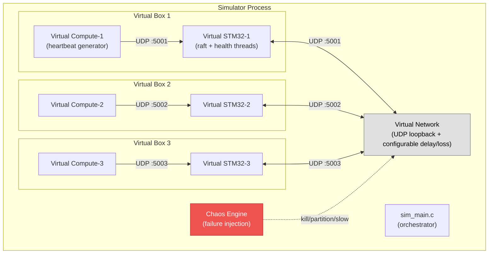

### Simulator Features

- Same `raft_oracle.c` + `health_monitor.c` source as firmware (different transport backend)
- Configurable: N boxes, M compute nodes per box, network latency/jitter/loss
- Chaos injection: node crash, network partition, slow heartbeats, split-brain scenarios
- Output: structured JSON events for automated test validation
- CI-friendly: `nix build '.#checks.x86_64-linux.sim-test'`

### Test Scenarios (automated)

| Scenario | Inject | Assert |
|---|---|---|
| Single node failure | Kill one virtual compute | DOWN committed < 100ms |
| Leader failover | Kill leader STM32 | New leader elected < 500ms |
| Network partition (minority) | Isolate 1 STM32 | Majority continues, minority steps down |
| Full box loss | Kill STM32 + all compute in one box | All box nodes marked DOWN |
| Quorum loss | Kill 2/3 STM32s | Remaining STM32 enters no-quorum, stops asserting |
| Recovery | Restore killed node | Re-joins, catches up log, reports UP |
| 1000-cycle soak | Random kill/restore over 1000 iterations | Zero false positives, zero state corruption |

---

## 11. Demo Plan

### Setup

1. Power on spine switch, 3-4 box switches, 3-4 STM32s, 4-6 compute nodes.
2. STM32s start in Follower state, election fires within ~300ms, one leader emerges.
3. `oracle-agent` on each compute node announces itself then begins heartbeating.
4. Oracle converges: all nodes UP.
5. `tools/frame_sniffer.py` on a laptop tapped into the spine shows traffic.

### Demo Sequence

| Step | Action | Expected | Metric |
|---|---|---|---|
| 1 | Show sniffer output | Raft keepalives (50ms), node heartbeats (10ms) | Visual |
| 2 | Show `oracle-agent` health table | All UP, leader identified | `curl :9100/health` |
| 3 | Pull power on x86-2 | DEGRADED in ~30ms, SUSPECTED_FAILED in ~80ms | Sniffer timestamps |
| 4 | Show k3s reaction | Node cordoned + etcd member removed in ~120ms | `kubectl get nodes -w` + `etcdctl member list` |
| 5 | Restore x86-2 | Tombstone rejoin (~30-90s), auto-uncordon | `etcdctl member list` |
| 6 | Kill entire Box 3 | All Box 3 nodes DOWN, oracle continues (3/4 or 2/3 quorum) | Sniffer |
| 7 | Kill another box | Quorum lost, LEDs red, oracle degraded | LED state |
| 8 | Restore one box | Quorum restored, auto-recovery | Timing |

### Success Criteria

| Metric | Target |
|---|---|
| Failure detection (power loss → SUSPECTED_FAILED committed) | <100ms |
| Quorum restoration (SUSPECTED_FAILED → member removed) | <200ms total |
| Leader election after leader-STM32 failure | <500ms |
| False positive rate over 24h soak | 0 |
| Correct behavior through 1000+ power-cycle events | 100% |
| Memory usage on F207ZG | <120 KB |
| Cluster survives loss of 1 STM32 (N-1 quorum) | Yes |
| Graceful degradation at quorum loss | Yes (stops asserting) |

---

## 12. Open Questions

1. **STM32 inventory check.** Pending: which boards with Ethernet are already available? If none, order F207ZG Nucleos.

2. **Persistent state strategy.** Raft requires `currentTerm` + `votedFor` to survive crashes. Options:
   - (a) Ignore for v1 — fast restart causes extra election, acceptable
   - (b) One flash sector with wear-levelling
   - (c) FRAM over SPI
   - **Decision: (a) for v1.**

3. **Heartbeat interval tuning.** 10ms compute→STM32 = ~100-400 heartbeats/sec per STM32. Validate ETH peripheral + FreeRTOS handles this without drops. Bench on day 1.

4. **Registration protocol.** `MSG_NODE_ANNOUNCE` → STM32 → `MSG_NODE_ANNOUNCE_ACK`. Timeout: 3 retries at 100ms intervals. If no ACK, compute node logs error and retries every 1s.

5. **VLAN strategy.** With managed switches available (both 10G-uplink leaves and MikroTik), we can VLAN-tag oracle traffic. Defer to v2 unless lab network interference observed.

6. **Zig migration criteria.** Evaluate after v1 if: (a) UB bugs appear, (b) binary size exceeds flash budget, (c) cross-compilation becomes painful. The module boundary (transport HAL) allows incremental migration.

7. **Switch-fabric extension (v2).** Swap one box's switch for Microchip KSZ9893 dev board. STM32 injects/extracts through CPU port. Transport-only change.

---

## 13. Risk Register

| Risk | L | I | Mitigation |
|---|---|---|---|
| Raw-MAC code paths fragile on STM32 HAL | M | H | Use official `ETH_HandleTypeDef`; reference ST forum; test day 1 |
| Heartbeat storms from compute nodes | L | M | 10ms × 4 nodes = 400 fps — well within ETH capacity |
| F207ZG out of stock | M | L | F429ZI fallback (same Ethernet HW) |
| willemt/raft malloc usage on bare-metal | L | M | Static alloc wrapper, max 8 nodes, tested in sim first |
| Inter-box jitter from spine switch | L | L | Conservative Raft timeouts; measure 99p on day 1 |
| k3s API server latency dominates e2e | M | M | If >50ms, switch to DaemonSet oracle-agent with Unix socket |
| AF_PACKET latency on Jetson kernel | L | M | `SCHED_FIFO` for oracle-agent; heartbeat is 32-byte write |
| Nix cross-compilation breaks on updates | L | M | Pin nixpkgs; CI validates `nix build` on every push |

---

## 14. Iteration Plan

| Version | Focus | Deliverable |
|---|---|---|
| **v0.3** | Design spec | Hardware locked, wire format spec, willemt/raft plan |
| **v0.4** | Oracle-agent integration | Sections 7-8 rewritten with fencing taxonomy, tombstone awareness |
| **v0.5** | Resource audit + observation sideband | willemt/raft audit, memory budget correction, AE response extension for multi-observer corroboration |
| **v0.6** | Repo bootstrap | `nix develop` works, empty firmware builds, simulator skeleton |
| **v0.7** | Simulator MVP | 3-node Raft running in sim with failure injection + observation corroboration |
| **v0.8** | Firmware MVP | Single STM32 running Raft, L2 TX/RX proven on wire |
| **v0.9** | Multi-node firmware | 3 STM32s achieve consensus, health table replicates, observation sideband flows |
| **v0.10** | Host integration | `oracle-agent` sends heartbeats, receives health events |
| **v0.11** | k3s integration | Fencing: member remove, cross-check, end-to-end demo path |
| **v1.0** | Demo | Full hackathon demo with chaos testing |

---

## Appendix A — Why Not Other Approaches

| Approach | Why Rejected |
|---|---|
| **Jetson SPE (R5F)** | Different ARM profile, no direct networking, less honest as Cortex-M3 analog |
| **UART/SPI between nodes** | Forces two protocols. L2-everywhere matches production SoC model. |
| **STM32 + KSZ9893 managed switch** | Higher fidelity but adds complexity. Deferred to v2. |
| **NXP RT1180 (integrated TSN)** | ~3x BOM, not real M3, hides boundaries we want to exercise |
| **Full etcd replacement** | Wrong scope. Oracle provides speed of failure awareness, not state. |
| **Custom Raft from scratch** | willemt/raft exists, is tested, and maps cleanly. Don't re-invent. |

## Appendix B — Relationship to Production Service Processors

| Aspect | Hackathon PoC | Production SoC |
|---|---|---|
| Service processor | STM32 Nucleo (external) | Cortex-M3 (embedded in switching ASIC) |
| Switch fabric | GbE managed switch | ASIC switching pipeline |
| L2 transport | Raw Ethernet via RJ45 | Management frame inject/extract via vendor SDK |
| Host communication | Same L2 segment via switch | Internal bus (mailbox + shared memory) |
| Firmware access | Open (ST HAL + FreeRTOS) | Requires vendor licensing |
| Raft implementation | willemt/raft (C, vendored) | Same, or Zig port |

**What transfers directly:** Raft FSM, health monitoring logic, wire protocol format, timing parameters, FreeRTOS task structure.

**What requires new transport implementation:** MAC send/recv (STM32 ETH -> vendor SDK inject/extract), host IPC (AF_PACKET -> internal mailbox).

---

## Appendix D — Hackathon Demo: Nucleo-Only Scope (June 9, 2026)

> **Scope pivot (June 8):** The hackathon demo is narrowed to **Nucleo boards only** — no compute nodes, no oracle-agent, no k3s integration. The goal is Raft consensus running on real hardware, with failures demonstrated by pulling Ethernet cables and pressing reset buttons. Serial consoles on laptops show state changes in real time.

### D.1 What We're Demonstrating

Three or four STM32 Nucleo-F207ZG boards running the Raft consensus algorithm over raw L2 Ethernet, connected through any commodity unmanaged switch. Each board elects a leader, replicates log entries, and detects peer failures when boards lose network connectivity or are reset. The audience sees:

1. **Leader election** — boards start up, hold an election, one becomes leader (visible on serial console)
2. **Steady-state consensus** — leader sends AppendEntries keepalives every 50ms, followers ACK
3. **Node failure detection** — pull a cable or press reset: remaining nodes detect the loss within ~150-300ms (Raft heartbeat timeout), log the event
4. **Leader failover** — pull the leader's cable: a new election completes in <500ms, new leader emerges
5. **Quorum loss** — pull 2 of 3 cables: surviving node recognizes it has lost quorum, stops asserting
6. **Recovery** — replug cables: returning nodes rejoin the cluster, catch up on missed log entries

No compute nodes are involved. The STM32s are both the Raft participants **and** the thing being monitored (they monitor each other via Raft heartbeats). The health table tracks STM32 peer status only — no `MSG_NODE_HEARTBEAT` from external hosts.

### D.2 Hardware Setup

| Item | Qty | Notes |
|---|---|---|
| STM32 Nucleo-F207ZG | 3-4 | Each flashed with unique `NODE_ID` (1, 2, 3, 4) |
| Ethernet switch | 1 | Any unmanaged switch with 4+ ports (nothing special) |
| Cat6 patch cables | 3-4 | Nucleo RJ45 → switch |
| USB cables (Mini-B) | 3-4 | Nucleo ST-LINK → laptop USB for serial console + power |
| Laptops / notebooks | 1-3 | Running serial terminals (`minicom`, `screen`, `picocom`) |

One laptop can monitor multiple boards via USB hub. The minimum viable demo is **one laptop + 3 Nucleos + 1 switch**.

### D.3 Demo Topology

```
  ┌─────────────────────────────────────────────────────┐
  │              Unmanaged Ethernet Switch               │
  │   port 1      port 2      port 3      port 4        │
  └────┬──────────┬──────────┬──────────┬───────────────┘
       │ RJ45     │ RJ45     │ RJ45     │ RJ45
  ┌────┴────┐┌────┴────┐┌────┴────┐┌────┴────┐
  │ Nucleo  ││ Nucleo  ││ Nucleo  ││ Nucleo  │
  │ Node 1  ││ Node 2  ││ Node 3  ││ Node 4  │
  │ (LED:G) ││ (LED:G) ││ (LED:G) ││ (LED:G) │
  └────┬────┘└────┬────┘└────┬────┘└────┬────┘
       │ USB      │ USB      │ USB      │ USB
       │          │          │          │
  ┌────┴──────────┴────┐┌────┴──────────┴────┐
  │   Laptop A         ││   Laptop B         │
  │   serial consoles  ││   serial consoles  │
  │   (nodes 1 & 2)    ││   (nodes 3 & 4)    │
  └────────────────────┘└────────────────────┘
```

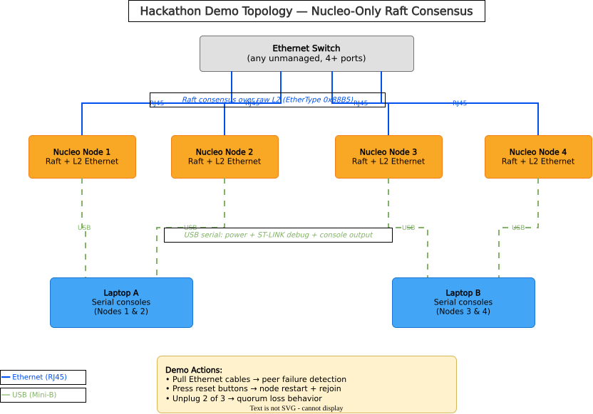

### D.4 Steps to Demo-Ready

#### Phase 0: Simulator Validation (contingency / pre-work)

The POSIX simulator (`sim/`) already runs the same Raft + health monitoring code as the firmware, using UDP loopback instead of real Ethernet. It provides a complete software-only demo path:

```bash
cd sim && mkdir -p build && cd build
cmake .. && make
./raft_sim 3           # 3-node clean consensus
./raft_sim 3 --chaos   # compute kill at t=3s, leader kill at t=8s
```

**What the simulator already demonstrates:**
- Leader election and steady-state AppendEntries (same code as firmware)
- Node failure detection with health state transitions (UP → SUSPECT → DOWN)
- Leader failover after leader kill (new election within ~1s)
- Raft-committed health transitions (commit index advances on DOWN)

**Contingency:** If hardware issues block the live demo, the simulator output on a projector demonstrates every algorithm behavior. The audience sees the same state machine, same detection logic, same Raft integration — just on a laptop instead of real boards.

#### Phase 1: Build and Flash Firmware (per board)

Each Nucleo needs firmware built with its unique node ID and the correct cluster size:

```bash
# For a 3-node cluster:
nix develop --command bash -c \
  "cmake --preset firmware -DNODE_ID=1 -DCLUSTER_NODES=3 && cmake --build build/firmware"

# Flash via ST-LINK:
nix develop --command bash -c \
  "openocd -f interface/stlink.cfg -f target/stm32f2x.cfg \
   -c 'program build/firmware/firmware/raft_oracle_node1.hex verify reset exit'"

# Repeat for NODE_ID=2, 3 (and 4 if using 4 boards)
# Or use: tools/build_all_nodes.sh
```

**Verification:** Connect serial console (`minicom -D /dev/ttyACM0 -b 115200`), confirm:
- `[raft] state=FOLLOWER` appears within 1 second of boot
- If single board on switch: `state=LEADER` after election timeout (~300ms)

#### Phase 2: Connect and Verify Multi-Node

1. Plug all Nucleos into the switch via Ethernet
2. Power all boards (USB from laptops)
3. Watch serial consoles — within ~1 second:
   - One board prints `state=LEADER`
   - Others print `state=FOLLOWER`
   - Leader shows `commit=N` advancing as keepalives flow

**What to check:**
- All boards agree on the same leader (leader ID in status output)
- Term numbers are consistent across boards
- No repeated elections (stable leader)

#### Phase 3: Failure Demo Rehearsal

Practice the demo sequence before showtime:

| Demo | Action | What to watch on serial |
|---|---|---|
| **Cable pull** | Unplug one follower's Ethernet | Remaining nodes: peer marked unreachable within ~300ms |
| **Cable replug** | Replug it | Returning node rejoins, catches up log |
| **Leader kill** | Unplug leader's Ethernet | New election fires, new leader within ~500ms |
| **Reset button** | Press reset on a Nucleo | Same as cable pull + node reboots and rejoins |
| **Quorum loss** | Unplug 2 of 3 | Survivor detects quorum loss, stops committing |
| **Full recovery** | Replug all | Election fires, cluster reconverges |

#### Phase 4: Demo Day Script

1. **"Here's the system"** — show the physical setup: boards, switch, cables, serial consoles
2. **"They just elected a leader"** — point at serial output showing LEADER/FOLLOWER states
3. **"Watch what happens when a node fails"** — pull a cable, audience sees detection in <300ms
4. **"Now let's kill the leader"** — pull the leader's cable, new leader elected in <500ms
5. **"What if we lose quorum?"** — pull another cable, survivor stops asserting
6. **"And recovery"** — replug cables, cluster heals itself

### D.5 What's Explicitly Out of Scope

These are all part of the full design (Sections 7-8) but are **not** in the hackathon demo:

- Compute node heartbeats (`MSG_NODE_HEARTBEAT` from hosts)
- oracle-agent daemon on compute nodes
- k3s/etcd integration (`etcdctl member remove`, `kubectl cordon`)
- Health event notifications to hosts (`MSG_HEALTH_UPDATE`, `MSG_FAILURE_EVENT`)
- Cross-check safety interlocks
- Fencing taxonomy execution
- Prometheus metrics

The hackathon demo proves **the core**: Raft consensus on real embedded hardware with real Ethernet, leader election, failure detection, and recovery. Everything else layers on top of this working foundation.

### D.6 Success Criteria (Hackathon-Scoped)

| Metric | Target |
|---|---|
| Leader election from cold boot | <1 second |
| Stable leader (no flapping) in steady state | Yes |
| Peer failure detection (cable pull → log message) | <500ms |
| Leader failover (leader cable pull → new leader) | <1 second |
| Correct quorum loss behavior (2/3 down → stop committing) | Yes |
| Recovery after cable replug | Rejoin within ~2 seconds |
| Runs continuously without crash for 10+ minutes | Yes |

### D.7 Known Firmware Status (as of June 8, 2026)

**Working:**
- Firmware builds and boots on Nucleo-F207ZG in <1 second
- FreeRTOS tasks running, heap within budget (29KB free)
- Raft state machine functional (single-node leader election verified)
- Ethernet TX confirmed on wire — RequestVote (0x88B5) and CLUSTER_STATE (0x88B6) frames observed
- `CLUSTER_NODES=1` mode for single-board testing
- Serial console output with raft state, term, leader, commit index, health table

**Needs verification with multiple boards:**
- Multi-node leader election via real Ethernet (works in simulator)
- Ethernet RX path processing Raft messages from peers
- Peer failure detection via Raft heartbeat timeout
- Log replication across boards
- Recovery after cable replug or board reset

The simulator has validated all of these behaviors. The remaining work is confirming they work over real Ethernet between real boards — which is exactly what the demo demonstrates.

---

## Appendix E — willemt/raft Library Reference

- **Repository**: https://github.com/willemt/raft
- **Key files**: `src/raft_server.c` (1435 lines — core algorithm), `src/raft_log.c` (315 lines — ring buffer), `src/raft_node.c` (192 lines), `src/raft_server_properties.c` (269 lines), `include/raft.h` (957 lines — full API), `include/raft_types.h` (type definitions)
- **Architecture**: Opaque `raft_server_t` handle (typedef void*), callback-driven via `raft_cbs_t` (14 callbacks)
- **Serialization**: **None.** Library constructs message structs on the stack, passes to caller via callback. Caller owns all wire format. Library accesses only named fields in received message structs (no memcpy/sizeof on message structs). This is why extending RPC payloads with sideband data is safe.
- **Sideband precedent**: `msg_appendentries_response_t` already contains `/* Non-Raft fields follow: */` with `current_idx` and `first_idx` — library author's own extension pattern.
- **Thread safety**: None (single-threaded by design). Our `raft_task` owns the instance exclusively.
- **Memory**: 6 allocation sites, all replaceable via `raft_set_heap_functions()`. Log ring buffer uses doubling realloc — must be pre-allocated to prevent OOM. See Section 5.3 for full audit.
- **Data types**: All `int`/`long int` (4 bytes on ARM). `sizeof(raft_entry_t)` = 20 bytes. `entry.data` = `{void *buf, unsigned int len}` — opaque, never dereferenced by library.
- **Code size**: ~9 KB .text on Thumb-2. No FP, no recursion, no VLAs.
- **Stack concern**: `__log()` allocates 1024-byte buffer. Stub for production (see Section 5.3).
- **Timer model**: `raft_periodic(raft, elapsed_ms)` — caller provides monotonic time deltas.
- **License**: BSD-2-Clause
