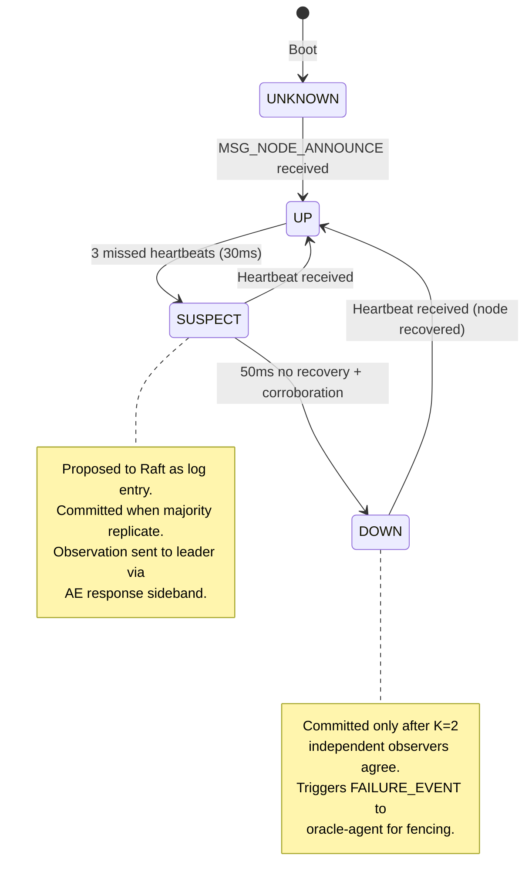
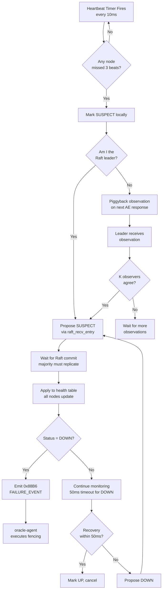

# Health State Machine

## Node Health States

## Timing Diagram

```mermaid
gantt
    title Failure Detection Timeline (worst case)
    dateFormat X
    axisFormat %Lms

    section Heartbeats
    Normal (10ms interval)     :done, 0, 30
    Missed beat 1              :crit, 30, 40
    Missed beat 2              :crit, 40, 50
    Missed beat 3              :crit, 50, 60

    section Detection
    SUSPECT (local)            :active, 60, 65
    Raft propose SUSPECT       :65, 70
    Raft commit SUSPECT        :70, 75

    section Corroboration
    Wait for recovery          :75, 110
    DOWN (local)               :crit, 110, 115
    Raft propose DOWN          :115, 120
    Raft commit DOWN           :120, 125

    section Fencing
    FAILURE_EVENT sent         :milestone, 125, 125
    oracle-agent receives      :125, 130
    kubectl cordon             :130, 200
```

## Decision Flow

## What Gets Replicated vs Local

| State | Scope | Mechanism |
|-------|-------|-----------|
| Heartbeat timestamps | Local only | Per-node `last_seen_ms` in health_monitor |
| Miss counters | Local only | Per-node `miss_count` array |
| SUSPECT transition | **Raft-committed** | Proposed as log entry, all nodes apply |
| DOWN transition | **Raft-committed** | Requires corroboration before proposal |
| Health table | **Raft-committed** | Updated in `applylog` callback |
| Cluster state broadcast | Leader-originated | Sent every 1s to compute nodes |
