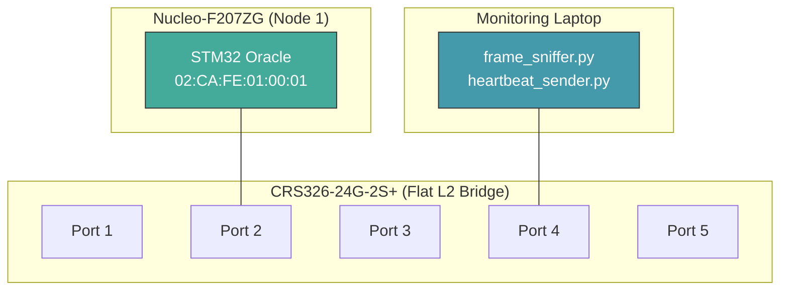
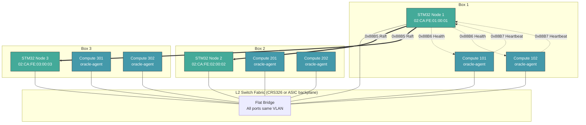

# Network Topology

## Hackathon Setup (Single Box)

## Production Setup (3-Box Cluster)

## MAC Address Scheme

| Component | MAC Format | Example |
|-----------|-----------|---------|
| STM32 oracle node | `02:CA:FE:<box>:00:<node>` | `02:CA:FE:01:00:01` (box 1, node 1) |
| Compute node | `02:CA:FE:<box>:00:<id>` | `02:CA:FE:01:00:65` (box 1, node 101) |
| Broadcast | `FF:FF:FF:FF:FF:FF` | All heartbeats use broadcast |

The `02:` prefix indicates locally-administered unicast (IEEE bit 1 of first octet).

## Frame Routing

All oracle frames use **broadcast** destination MAC (`FF:FF:FF:FF:FF:FF`). On a flat L2 bridge:
- Every port receives every frame (no MAC learning needed)
- STM32 nodes filter by EtherType in software
- No configuration needed on the switch (just plug in)

This is intentional: it matches the production model where the service processor sees ALL management frames transiting the switch backplane via frame-extract. It also means adding/removing nodes requires zero switch configuration.
