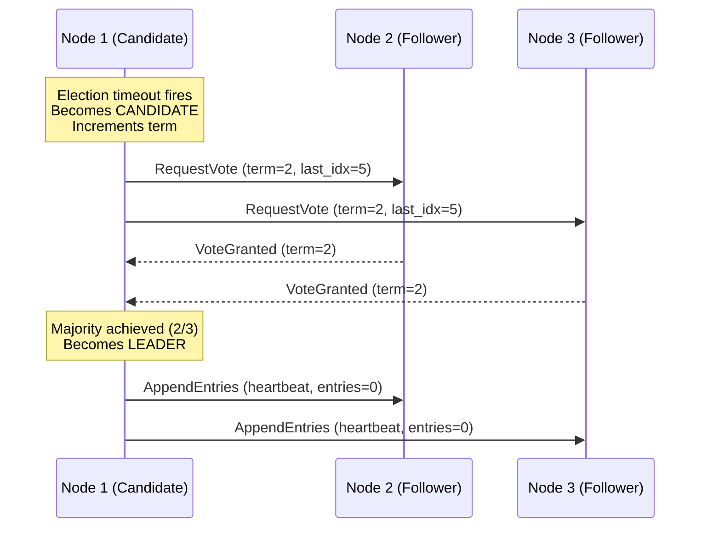
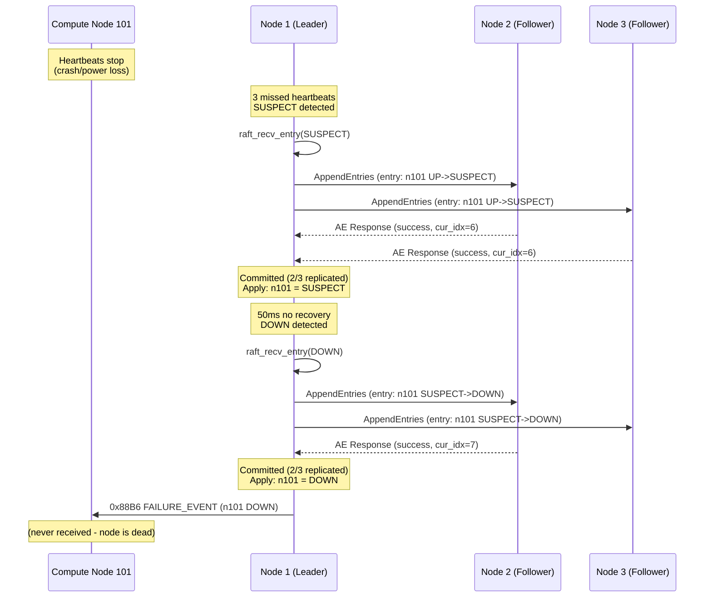
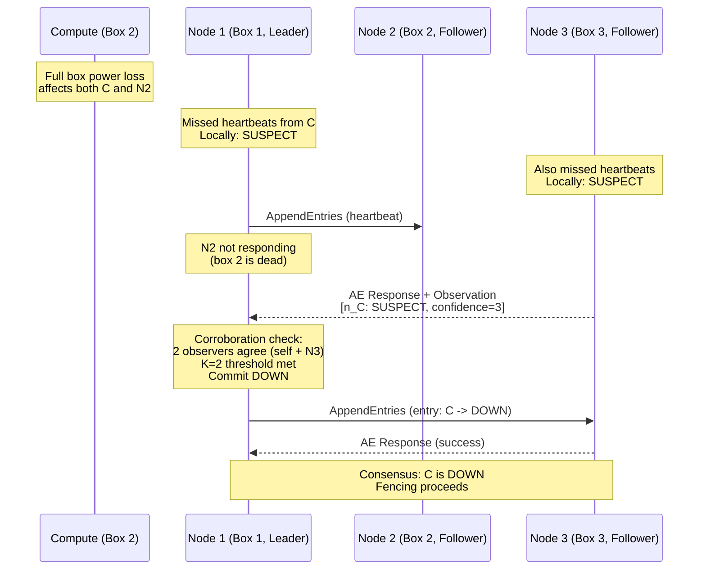
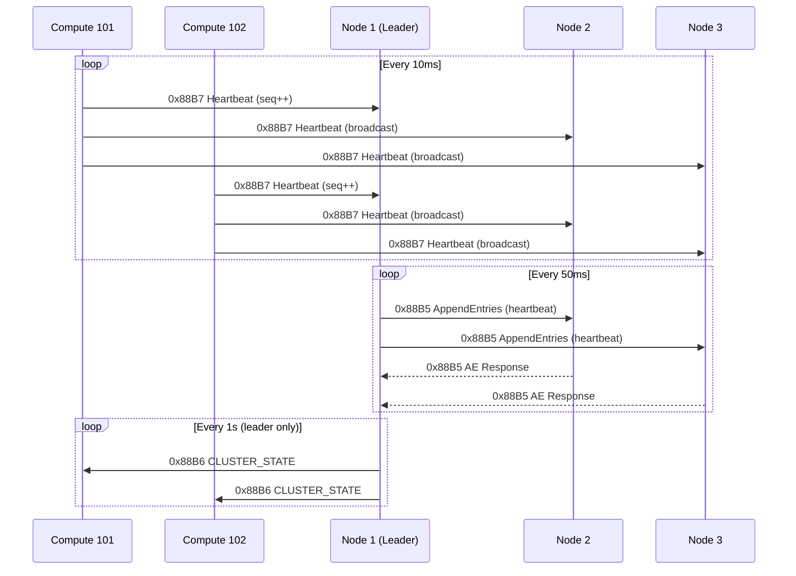

# Raft Message Flow

## Leader Election (RequestVote)

```mermaid
sequenceDiagram
    participant N1 as Node 1 (Candidate)
    participant N2 as Node 2 (Follower)
    participant N3 as Node 3 (Follower)

    Note over N1: Election timeout fires<br/>Becomes CANDIDATE<br/>Increments term

    N1->>N2: RequestVote (term=2, last_idx=5)
    N1->>N3: RequestVote (term=2, last_idx=5)

    N2-->>N1: VoteGranted (term=2)
    N3-->>N1: VoteGranted (term=2)

    Note over N1: Majority achieved (2/3)<br/>Becomes LEADER

    N1->>N2: AppendEntries (heartbeat, entries=0)
    N1->>N3: AppendEntries (heartbeat, entries=0)
```

## Health State Replication (AppendEntries)

```mermaid
sequenceDiagram
    participant C as Compute Node 101
    participant N1 as Node 1 (Leader)
    participant N2 as Node 2 (Follower)
    participant N3 as Node 3 (Follower)

    Note over C: Heartbeats stop<br/>(crash/power loss)

    Note over N1: 3 missed heartbeats<br/>SUSPECT detected

    N1->>N1: raft_recv_entry(SUSPECT)
    N1->>N2: AppendEntries (entry: n101 UP->SUSPECT)
    N1->>N3: AppendEntries (entry: n101 UP->SUSPECT)
    N2-->>N1: AE Response (success, cur_idx=6)
    N3-->>N1: AE Response (success, cur_idx=6)

    Note over N1: Committed (2/3 replicated)<br/>Apply: n101 = SUSPECT

    Note over N1: 50ms no recovery<br/>DOWN detected

    N1->>N1: raft_recv_entry(DOWN)
    N1->>N2: AppendEntries (entry: n101 SUSPECT->DOWN)
    N1->>N3: AppendEntries (entry: n101 SUSPECT->DOWN)
    N2-->>N1: AE Response (success, cur_idx=7)

    Note over N1: Committed (2/3 replicated)<br/>Apply: n101 = DOWN

    N1->>C: 0x88B6 FAILURE_EVENT (n101 DOWN)
    Note over C: (never received - node is dead)
```

## Multi-Observer Corroboration (Cross-Box Failure)

```mermaid
sequenceDiagram
    participant C as Compute (Box 2)
    participant N1 as Node 1 (Box 1, Leader)
    participant N2 as Node 2 (Box 2, Follower)
    participant N3 as Node 3 (Box 3, Follower)

    Note over C: Full box power loss<br/>affects both C and N2

    Note over N1: Missed heartbeats from C<br/>Locally: SUSPECT

    Note over N3: Also missed heartbeats<br/>Locally: SUSPECT

    N1->>N2: AppendEntries (heartbeat)
    Note over N1: N2 not responding<br/>(box 2 is dead)

    N3-->>N1: AE Response + Observation<br/>[n_C: SUSPECT, confidence=3]

    Note over N1: Corroboration check:<br/>2 observers agree (self + N3)<br/>K=2 threshold met<br/>Commit DOWN

    N1->>N3: AppendEntries (entry: C -> DOWN)
    N3-->>N1: AE Response (success)

    Note over N1,N3: Consensus: C is DOWN<br/>Fencing proceeds
```

## Steady-State Heartbeat Pattern

```mermaid
sequenceDiagram
    participant C1 as Compute 101
    participant C2 as Compute 102
    participant N1 as Node 1 (Leader)
    participant N2 as Node 2
    participant N3 as Node 3

    loop Every 10ms
        C1->>N1: 0x88B7 Heartbeat (seq++)
        C1->>N2: 0x88B7 Heartbeat (broadcast)
        C1->>N3: 0x88B7 Heartbeat (broadcast)
        C2->>N1: 0x88B7 Heartbeat (seq++)
        C2->>N2: 0x88B7 Heartbeat (broadcast)
        C2->>N3: 0x88B7 Heartbeat (broadcast)
    end

    loop Every 50ms
        N1->>N2: 0x88B5 AppendEntries (heartbeat)
        N1->>N3: 0x88B5 AppendEntries (heartbeat)
        N2-->>N1: 0x88B5 AE Response
        N3-->>N1: 0x88B5 AE Response
    end

    loop Every 1s (leader only)
        N1->>C1: 0x88B6 CLUSTER_STATE
        N1->>C2: 0x88B6 CLUSTER_STATE
    end
```
