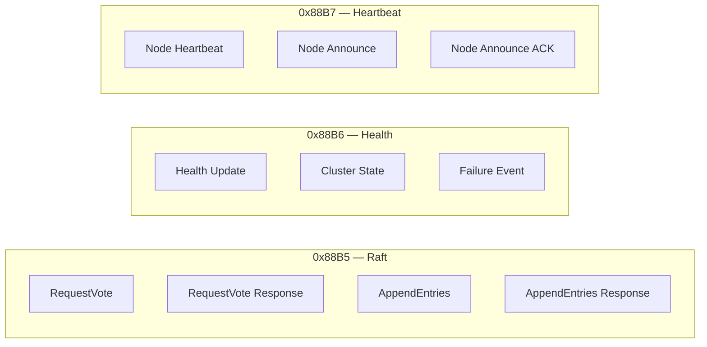

# Wire Protocol Reference

## Frame Layout

```
 Byte:  0              6             12   14 15 16 17 18          22  24
        +--------------+-------------+----+--+--+--+--+-----------+---+----------+
        |  Dst MAC     |  Src MAC    | ET |V |MT|NI|BI|   Term    |PL | Payload  |
        |  (6 bytes)   |  (6 bytes)  |(2B)|  |  |  |  |  (4B LE) |(2B)| (0-64B) |
        +--------------+-------------+----+--+--+--+--+-----------+---+----------+
        |<-- Ethernet II Header (14B) -->|<-- Oracle Protocol Header (10B) -->|
```

| Field | Offset | Size | Description |
|-------|--------|------|-------------|
| Dst MAC | 0 | 6 | Always `FF:FF:FF:FF:FF:FF` (broadcast) |
| Src MAC | 6 | 6 | Sender's MAC (`02:CA:FE:<box>:00:<node>`) |
| EtherType | 12 | 2 | `0x88B5` / `0x88B6` / `0x88B7` (big-endian) |
| Version | 14 | 1 | Protocol version (upper nibble = major, lower = minor). Current: `0x10` |
| Msg Type | 15 | 1 | Message type (see table below) |
| Node ID | 16 | 1 | Sender's node ID |
| Box ID | 17 | 1 | Sender's box ID |
| Term | 18 | 4 | Raft term (little-endian uint32) |
| Payload Len | 22 | 2 | Payload length in bytes (little-endian uint16) |
| Payload | 24 | 0-64 | Message-specific payload (packed, little-endian) |

## EtherTypes



## Message Types

| Code | Name | EtherType | Direction | Payload Size |
|------|------|-----------|-----------|-------------|
| `0x01` | REQUEST_VOTE | 0x88B5 | STM32 → STM32 | 16B |
| `0x02` | REQUEST_VOTE_RESP | 0x88B5 | STM32 → STM32 | 8B |
| `0x03` | APPEND_ENTRIES | 0x88B5 | Leader → Follower | 16B + entries |
| `0x04` | APPEND_ENTRIES_RESP | 0x88B5 | Follower → Leader | 16B + observations |
| `0x10` | HEALTH_UPDATE | 0x88B6 | STM32 → Compute | 12B |
| `0x11` | CLUSTER_STATE | 0x88B6 | Leader → Compute | 4B + 12B/node |
| `0x12` | FAILURE_EVENT | 0x88B6 | STM32 → Compute | 12B |
| `0x20` | NODE_HEARTBEAT | 0x88B7 | Compute → STM32 | 8B |
| `0x21` | NODE_ANNOUNCE | 0x88B7 | Compute → STM32 | 16B |
| `0x22` | NODE_ANNOUNCE_ACK | 0x88B7 | STM32 → Compute | 4B |

## Payload Structures

### NODE_HEARTBEAT (0x20) — 8 bytes

```
 0          4     6     8
 +----------+-----+-----+
 |   seq    |load | rsvd|
 | uint32   |u16  | u16 |
 +----------+-----+-----+
```

- `seq`: incrementing sequence number
- `load`: CPU load in 0.1% units (0-1000)

### NODE_ANNOUNCE (0x21) — 16 bytes

```
 0  1     4          10        16
 +--+-----+----------+---------+
 |NT|rsvd | MAC (6B) |hostname |
 |u8| 3B  |          | (6B)   |
 +--+-----+----------+---------+
```

- `NT`: node type (1=JETSON, 2=X86, 3=STM32)

### CLUSTER_STATE (0x11) — 4 + 12*N bytes

```
 0  1  2  3  4
 +--+--+--+--+--...--+
 |NN|LN|LB|QH| entries|
 |u8|u8|u8|u8| (12B each)|
 +--+--+--+--+--...--+

 Per-node entry (12 bytes):
 +--+--+--+--+----------+----------+
 |NI|BI|NT|ST| last_seen| st_term  |
 |u8|u8|u8|u8|  uint32  |  uint32  |
 +--+--+--+--+----------+----------+
```

- `NN`: number of nodes in table
- `LN/LB`: leader node/box ID
- `QH`: quorum healthy (1=yes, 0=no)
- `ST`: status (0=UP, 1=SUSPECT, 2=DOWN)

### APPEND_ENTRIES (0x03) — 16+ bytes

```
 0          4          8              12 13
 +----------+----------+--------------+--+--...--+
 | prev_idx |prev_term |leader_commit |NE|entries|
 | uint32   | uint32   |   uint32     |u8|       |
 +----------+----------+--------------+--+--...--+
```

### APPEND_ENTRIES_RESP (0x04) — 16+ bytes

```
 0          4          8              12 13
 +----------+----------+--------------+--+--...--+
 | success  | cur_idx  | first_idx    |NO| obs   |
 | uint32   | uint32   |   uint32     |u8| (4B each)|
 +----------+----------+--------------+--+--...--+
```

- `NO`: number of health observations piggybacked
- Each observation: `[node_id, status, confidence, reserved]` (4 bytes)

## Example: Captured Frame (heartbeat_sender.py output)

```
frame_sniffer.py output:
14:23:01.123 [HEARTBEAT] node=101 box=1 term=   0 NODE_HEARTBEAT       seq=42 load=15.0%

Raw hex (60 bytes minimum):
ff ff ff ff ff ff                 # dst: broadcast
02 ca fe 01 00 65                 # src: compute node 101 (0x65), box 1
88 b7                             # EtherType: HEARTBEAT
10                                # version 1.0
20                                # msg_type: NODE_HEARTBEAT
65                                # node_id: 101
01                                # box_id: 1
00 00 00 00                       # term: 0 (compute nodes don't participate in Raft)
08 00                             # payload_len: 8
2a 00 00 00                       # seq: 42
96 00                             # load: 150 (15.0%)
00 00                             # reserved
00 00 00 00 00 00 00 00 00 00     # padding to 60 bytes
00 00 00 00 00 00 00 00 00 00
00 00
```
